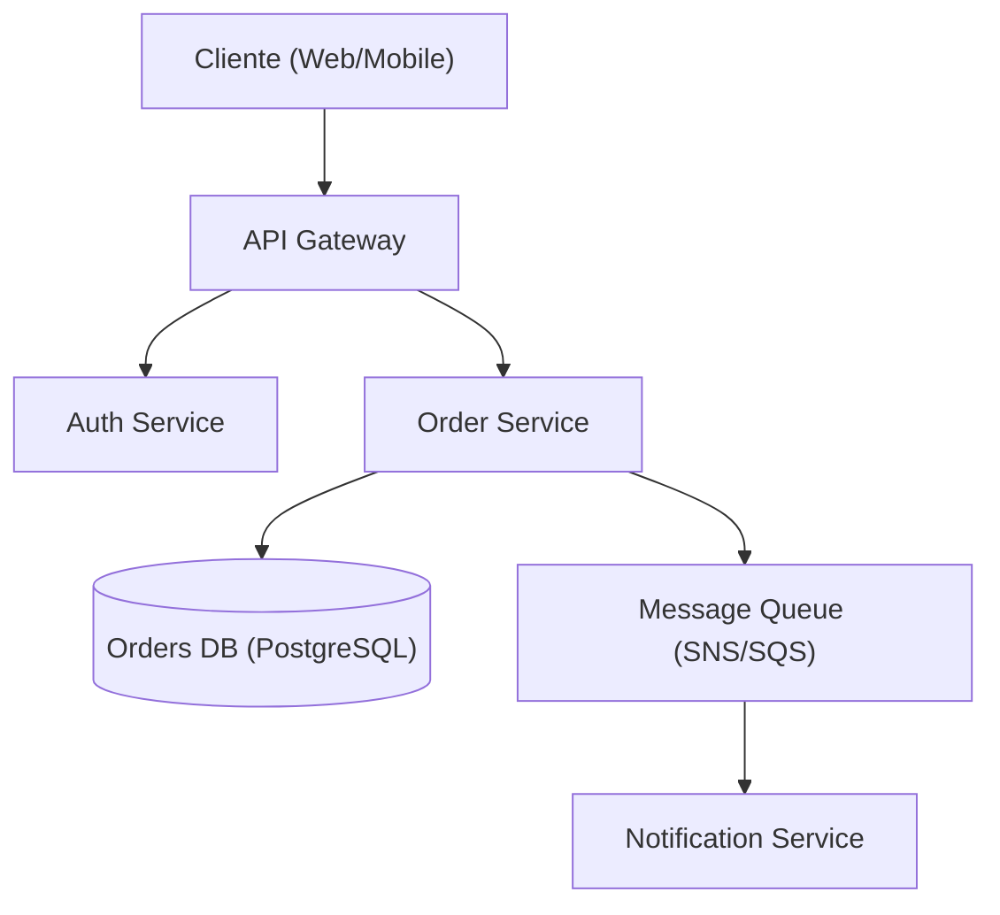

---

name: design-system-architecture
description: "Use when designing or reviewing the high-level architecture of a distributed system — choosing between monolith and microservices, writing Architecture Decision Records (ADRs), mapping component interactions, evaluating technology trade-offs, and planning for scalability and resilience. Distinct from `arquitetura-limpa-java` (which addresses intra-application layering) and `java-architecture` (Spring stack). Use for system design, architecture review, ADR authoring, scalability planning, and infrastructure pattern selection. Uso: agent `arquiteto-sistemas` ou invocação manual via `/design-system-architecture`; não deve ser carregada proativamente pela sessão principal."
license: MIT
metadata:
  author: https://github.com/srportto/srportto
  co-author: https://github.com/Jeffallan/claude-skills
  version: "1.1.0"
  domain: system-architecture
  triggers: system design, architecture, ADR, microservices, scalability, technical design, infrastructure, distributed systems, monolith decomposition
  role: architect
  scope: system-design
  output-format: document
  related-skills: arquitetura-limpa-java, java-architecture, api-rest-design, devops-cicd, cloud-architect, revisao-de-codigo-java
---
---

# Design de Arquitetura de Sistemas

Referência para desenhar ou revisar a arquitetura de **sistemas distribuídos** em alto nível:
escolha entre monolito e microsserviços, modelagem de componentes, ADRs (Architecture
Decision Records), trade-offs de tecnologia, e plano de escalabilidade/resiliência.

**Quando NÃO usar:**

- Para decidir **em qual camada** um código vai dentro de uma aplicação Java hexagonal
  (`domain`/`application`/`infrastructure`, com `port/in` e `port/out`), use
  `arquitetura-limpa-java`.
- Para a stack Spring Boot 4 + Java 25 (camadas clássicas, módulos Spring), use
  `java-architecture`.
- Para contrato de API REST (OpenAPI 3.1, RFC 9457), use `api-rest-design`.
- Para topologia de nuvem (VPC, IAM, FinOps, DR), use `cloud-architect`.
- Para um design pattern GoF (Strategy, Factory, etc.), use `padroes-de-projeto-java`.

## Quando aplicar

- Desenhar arquitetura de sistema novo ou nova fronteira de microsserviço.
- Revisar arquitetura existente antes de mudança grande (revisão estrutural, não de código).
- Escrever ADR para decisão de tecnologia, topologia ou trade-off relevante.
- Avaliar decomposição de monolito em microsserviços (DDD tático + bounded contexts).
- Planejar escalabilidade horizontal, particionamento de dados, SLOs.

## Workflow

1. **Levantar requisitos** — funcionais, não-funcionais (latência, throughput,
   disponibilidade), restrições (time, orçamento, compliance). Validar cobertura
   completa antes de seguir.
2. **Identificar padrões** — mapear requisitos a padrões arquiteturais (ver
   `references/architecture-patterns.md`).
3. **Desenhar** — topologia de componentes, fluxos críticos, fronteiras de
   bounded context. Produzir diagrama Mermaid.
4. **Documentar decisões** — ADR para cada decisão relevante (ver exemplo abaixo).
5. **Revisar com stakeholders** — se reprovado, voltar ao passo 3 com feedback
   registrado.

## Guia de referências

| Tópico | Referência | Quando carregar |
|---|---|---|
| Padrões arquiteturais | `references/architecture-patterns.md` | Escolha entre monolito e microsserviços |
| Template de ADR | `references/adr-template.md` | Documentar decisão |
| System design completo | `references/system-design.md` | Template end-to-end |
| Seleção de banco | `references/database-selection.md` | Escolher tecnologia de persistência |
| Checklist NFR | `references/nfr-checklist.md` | Levantar requisitos não-funcionais |

## Constraints

### MUST DO

- Documentar toda decisão relevante via ADR.
- Considerar explicitamente requisitos não-funcionais (NFR).
- Avaliar trade-offs, não só benefícios.
- Planejar para modos de falha (circuit breaker, retries, DLQ).
- Considerar complexidade operacional (on-call, runbooks, observabilidade).
- Revisar com stakeholders antes de finalizar.

### MUST NOT DO

- Over-engineer para escala hipotética (YAGNI).
- Escolher tecnologia sem avaliar alternativas.
- Ignorar custo operacional.
- Desenhar sem entender requisitos.
- Pular considerações de segurança (threat model mínimo).

## Templates de saída

Toda entrega deve conter:

1. Resumo de requisitos (funcionais + não-funcionais).
2. Diagrama de arquitetura de alto nível (Mermaid).
3. Decisões-chave com trade-offs (formato ADR).
4. Recomendações de tecnologia com justificativa.
5. Riscos e mitigações.

### Diagrama de arquitetura (Mermaid)



### Exemplo de ADR

````markdown
# ADR-001: Usar PostgreSQL para armazenar Pedidos

## Status
Aceito

## Contexto
O Order Service exige transações ACID e consultas relacionais complexas
(união de pedidos, itens, clientes, histórico).

## Decisão
Usar PostgreSQL como datastore primário do Order Service.

## Alternativas consideradas

- **MongoDB** — schema flexível, mas sem ACID forte entre documentos.
- **DynamoDB** — escalabilidade excelente, mas padrões de consulta complexos
  exigem denormalização agressiva.

## Consequências

- **Positivo:** consistência forte, tooling maduro, consultas complexas nativas.
- **Negativo:** limite de escala vertical; sharding horizontal adiciona
  complexidade operacional.

## Trade-offs
Consistência e flexibilidade de consulta priorizadas sobre escalabilidade
horizontal de escrita ilimitada.
````

## Quem aplica o quê

| Cenário | Agent / Modo | Skills complementares |
|---|---|---|
| Desenhar arquitetura nova | `arquiteto-sistemas` (sessão dedicada) | `arquitetura-limpa-java`, `cloud-architect` |
| Revisar arquitetura existente | `arquiteto-sistemas` (modo `auditoria`) | `revisao-de-codigo-java` |
| Escrever ADR pontual | sessão principal + `/design-system-architecture` | `arquitetura-limpa-java` |
| Decompor monolito | `arquiteto-sistemas` + `especialista-banco-dados` | `mensageria-sqs-kafka`, `monitoramento-java` |
| Validar design antes de implementação | `java-revisor` (modo `auditoria`) | esta skill como referência de critérios |

[Documentação base](https://jeffallan.github.io/claude-skills/skills/api-architecture/architecture-designer/)
_(renomeada neste catálogo para `design-system-architecture` para evitar sobreposição semântica
com `arquitetura-limpa-java` e `java-architecture`)_
