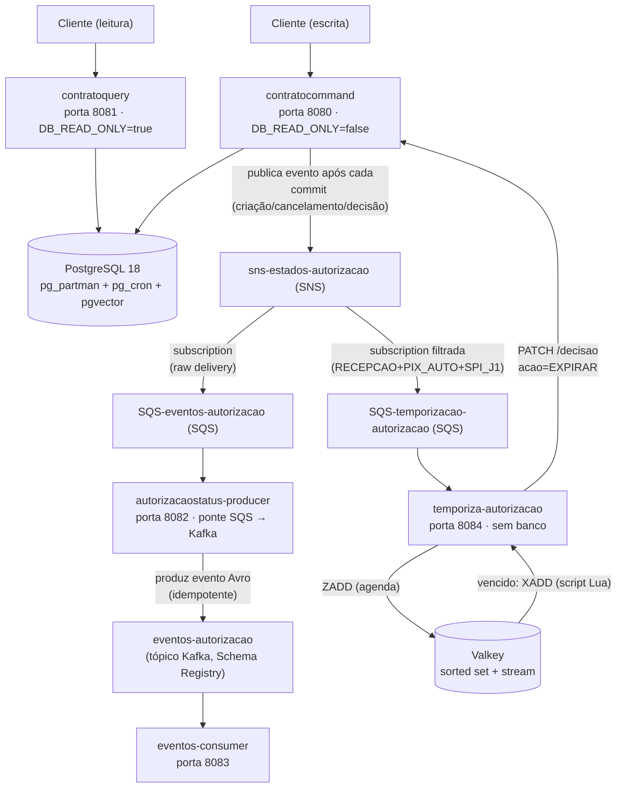

# arj-pagrecorrentes-dbrelacional

Sistema de **autorizações de pagamentos recorrentes** (PIX Automático e DDA Automático), composto por cinco microserviços Java que operam sobre um banco PostgreSQL particionado temporalmente.



## Microserviços

| Serviço | Porta | Responsabilidade | Read-Only |
|---------|-------|-----------------|-----------|
| [contratocommand](apps/contratocommand/README.md) | 8080 | Criar, cancelar e decidir autorizações (POST, PATCH); publica eventos de estado no SNS | Não |
| [contratoquery](apps/contratoquery/README.md) | 8081 | Listar e consultar autorizações (GET) | Sim |
| [autorizacaostatus-producer](apps/autorizacaostatus-producer/README.md) | 8082 | Ponte SQS → Kafka: consome a fila de eventos, converte para Avro e produz no tópico `eventos-autorizacao` de forma idempotente | N/A |
| [eventos-consumer](apps/eventos-consumer/README.md) | 8083 | Consome o tópico Kafka `eventos-autorizacao`, loga e confirma (ack) | N/A |
| [temporiza-autorizacao](apps/temporiza-autorizacao/README.md) | 8084 | Temporiza a jornada 1 do PIX_AUTO: agenda a expiração no Valkey e aciona `PATCH /decisao` no vencimento | N/A |

`contratocommand` e `contratoquery` compartilham o mesmo banco de dados e a mesma tabela `autorizacoes`, particionada por `id_particao_conta` (range 900–999). O UUID de cada autorização carrega a partição embutida (`ReversibleUUIDv7`), eliminando joins extras na leitura. `autorizacaostatus-producer`, `eventos-consumer` e `temporiza-autorizacao` não acessam o banco: os dois primeiros formam a ponte SQS → Kafka (a primeira consome a fila SQS alimentada pelos eventos publicados pelo `contratocommand` — ver [`infra/envs/local-messaging/`](infra/envs/local-messaging/) para provisionar tópico/filas no Floci — e produz no Kafka local, ver [`infra/local/kafka/`](infra/local/kafka/README.md); a segunda apenas consome esse tópico); `temporiza-autorizacao` consome uma fila **filtrada** do mesmo tópico SNS (só recepção de `PIX_AUTO` em `SPI_J1`), agenda no [Valkey local](infra/local/redis/README.md) e aciona de volta o `contratocommand` no vencimento de 10 minutos, sem nunca ler a tabela `autorizacoes`.

## Estrutura do Repositório

```
arj-pagrecorrentes-dbrelacional/
├── compose.yaml                # Ponto de entrada único do ambiente local (include: dos 5 abaixo)
├── apps/                       # Código de aplicação
│   ├── contratocommand/         # Microserviço de escrita (Java 25 + Spring Boot 4.0.7)
│   ├── contratoquery/           # Microserviço de leitura (Java 25 + Spring Boot 4.0.7)
│   ├── autorizacaostatus-producer/  # Ponte SQS -> Kafka (Java 25 + Spring Boot 4.0.7)
│   ├── eventos-consumer/            # Consumidora do tópico Kafka (Java 25 + Spring Boot 4.0.7)
│   ├── temporiza-autorizacao/       # Temporizador da jornada 1 do PIX_AUTO, sem banco (Java 25 + Spring Boot 4.0.7)
│   └── docker-compose.yml      # Ambiente local: as 5 apps (Postgres vem só de infra/local/postgres/)
├── infra/                      # Código de infraestrutura (esqueleto Terraform, ver infra/README.md)
│   ├── modules/                 # Módulos Terraform reutilizáveis (networking, rds-postgres, ecs-*, elasticache-valkey, observability)
│   ├── envs/{local,local-messaging,prod}/  # Composição dos módulos por ambiente
│   ├── bootstrap/               # State remoto (pré-requisito dos envs)
│   ├── local/postgres/          # Fonte única do Postgres 18 local (pg_partman + pg_cron + pgvector, migrations)
│   ├── local/kafka/             # Kafka local standalone (broker KRaft, Schema Registry, Kafbat UI)
│   ├── local/floci/             # Floci local (emula SNS/SQS)
│   └── local/redis/             # Valkey local (sorted set + stream para temporiza-autorizacao)
├── docs/
│   ├── arquitetura/                        # Diagramas de arquitetura + POC de particionamento (Buffer Ring/UUIDv7)
│   ├── info_build-my-image-and-execute.md  # Docker + PostgreSQL com partman/cron
│   └── contrato-api-para-gateway.md        # Insumo temporário p/ montar o gateway (ver nota no topo do arquivo)
├── openspec/                  # Planejamento de mudanças (proposta → spec → tasks)
├── .env.example                # Modelo do .env único (raiz) — copie para .env
├── LICENSE                    # MIT
└── README.md                  # Este arquivo
```

## Pré-requisitos

| Ferramenta | Versão mínima |
|------------|--------------|
| Java (JDK) | 25+ |
| Maven | 3.9+ |
| PostgreSQL | 18 (com `pg_partman`, `pg_cron` e `pgvector`) |
| Docker | Qualquer versão recente |

> PostgreSQL 18 é obrigatório — nenhum dos serviços possui fallback para H2 ou banco em memória.

## Começando

> `DB_PASSWORD` não tem valor padrão embutido nos arquivos de compose — a subida falha com erro
> explícito, nomeando a variável, se ela não estiver definida. Copie `.env.example` (raiz) para
> `.env` e defina sua própria senha local. Fonte única: não crie cópias de `.env` em `apps/` nem
> em `infra/local/*` — os composes desses caminhos leem do `.env` da raiz (veja `--env-file` na
> Opção C abaixo, para quando um deles sobe fora do compose de raiz).

### Opção A — Ponto de entrada único (recomendado)

Um único comando sobe o banco (com schema aplicado), a mensageria local (Floci, Kafka) e as
cinco aplicações — a ordem de subida está declarada no compose, não é conhecimento tácito:

```bash
docker compose up -d --build
```

- `contratocommand` → http://localhost:8080
- `contratoquery` → http://localhost:8081
- `autorizacaostatus-producer` → http://localhost:8082 — ponte SQS → Kafka
- `eventos-consumer` → http://localhost:8083 — loga cada evento consumido do Kafka
- `temporiza-autorizacao` — agenda e expira autorizações PIX_AUTO/SPI_J1; roda com 2 réplicas
  (`deploy.replicas`) e por isso **não publica porta no host** (sem endpoint de negócio, só
  `/actuator/health`, acessível via `docker compose exec` de dentro da rede)
- Dashboard do Kafka (mensagens, consumer groups, lag) → http://localhost:8090

Para o fluxo de eventos fim a fim funcionar (SNS → SQS → Kafka, e o timer da jornada 1), o
tópico/filas do Floci ainda precisam ser provisionados uma vez via Terraform — fora do escopo
deste compose (ver `infra/envs/local-messaging/`):

```bash
cd infra/envs/local-messaging && terraform init && terraform apply
```

Crie uma autorização `PIX_AUTO` com `tipoJornada: SPI_J1` no `contratocommand` e, sem uma
aprovação via `PATCH /api/autorizacoes/{id}/decisao`, ela é rejeitada automaticamente
(`REJEITADA_SISTEMA_TIMEOUT_J1`) 10 minutos depois.

### Opção B — Só um ambiente isolado

Cada compose de `infra/local/*` continua completo e válido por si — sobe sozinho, sem exigir
os demais no ar (ver o `README.md` de cada um: [postgres](infra/local/postgres/README.md),
[floci](infra/local/floci/README.md), [kafka](infra/local/kafka/README.md),
[redis](infra/local/redis/README.md)). Exemplo, só o banco:

```bash
cd infra/local/postgres
docker compose --env-file ../../../.env -f postgres-db-v18.yml up -d
```

### Opção C — Só as apps, contra infra já no ar

`apps/docker-compose.yml` permanece um arquivo próprio — útil para subir as cinco aplicações
sozinhas contra uma infra que já está no ar (pela Opção A ou pela B, ambiente por ambiente):

```bash
cd apps
docker compose --env-file ../.env up -d --build
```

### Opção D — Rodando uma aplicação manualmente (Maven)

Para depurar uma app fora do container, com a infra correspondente no ar:

```bash
cd apps/contratocommand
DB_NAME=db-csp-postgres DB_USER_NAME=docker DB_PASSWORD=sua_senha \
  mvn spring-boot:run
# Disponível em http://localhost:8080
```

Mesmo padrão para as outras quatro apps — `contratoquery` (8081, exige Postgres),
`autorizacaostatus-producer` (8082, exige Floci + Kafka), `eventos-consumer` (8083, exige Kafka)
e `temporiza-autorizacao` (8084, exige Floci + Valkey, e o `contratocommand` no ar para
acionar a decisão no vencimento).

> Consulte o README de cada app para a lista completa de variáveis de ambiente e comandos de build.

## Profiles Spring

Cada aplicação usa `application.yml` (configuração comum) mais `application-local.yml` e `application-prod.yml` (apenas o que difere entre ambientes). Não existe mais o profile `dev`.

- **Local** (padrão de desenvolvimento): ativado automaticamente quando `SPRING_PROFILES_ACTIVE` não é definido.
- **Produção**: **deve** definir `SPRING_PROFILES_ACTIVE=prod` explicitamente — o default `local` é só uma conveniência de desenvolvimento e não deve ser assumido em produção.

## CI

`.github/workflows/` mantém um workflow por preocupação, disparado só quando o path relevante muda:

| Workflow | O quê | Dispara em |
|---|---|---|
| `contrato-eventos.yml` | Compara as cópias espelhadas do contrato de evento (`AutorizacaoEventoPayload`, `.avsc`) | `apps/**`, `ci/contrato-eventos/**` |
| `ci-testesunitarios-<app>.yml` (uma por app) | Roda `mvn test -Dtest='!*IntegrationTest'` — só testes unitários, testes de integração excluídos por convenção de nome | `apps/<app>/**` |

Testes de integração (Postgres, Floci, Valkey) não rodam no CI hoje — seguem manuais, com infra local
no ar (ver `infra/local/`).

## Documentação

| Arquivo | Descrição |
|---------|-----------|
| [apps/contratocommand/README.md](apps/contratocommand/README.md) | Documentação completa do serviço de escrita |
| [apps/contratoquery/README.md](apps/contratoquery/README.md) | Documentação completa do serviço de leitura |
| [apps/autorizacaostatus-producer/README.md](apps/autorizacaostatus-producer/README.md) | Documentação completa da ponte SQS -> Kafka |
| [apps/eventos-consumer/README.md](apps/eventos-consumer/README.md) | Documentação completa da consumidora do tópico Kafka |
| [apps/temporiza-autorizacao/README.md](apps/temporiza-autorizacao/README.md) | Documentação completa do temporizador da jornada 1 do PIX_AUTO |
| [infra/README.md](infra/README.md) | Topologia-alvo de infraestrutura (Terraform, ambientes, escopo) |
| [infra/envs/local-messaging/README.md](infra/envs/local-messaging/README.md) | Provisionamento do tópico SNS e das filas SQS (eventos + temporização) no Floci |
| [infra/local/kafka/README.md](infra/local/kafka/README.md) | Kafka local standalone (broker, Schema Registry, dashboard) |
| [infra/local/redis/README.md](infra/local/redis/README.md) | Valkey local (sorted set + stream de expiração) |
| [docs/info_build-my-image-and-execute.md](docs/info_build-my-image-and-execute.md) | Build e execução via Docker |
| [infra/local/postgres/exemplos-queries.sql](infra/local/postgres/exemplos-queries.sql) | Scripts SQL de particionamento |
| [docs/arquitetura/modelo-dados-e-dados-poc-testada-para-essa-implementacao.md](docs/arquitetura/modelo-dados-e-dados-poc-testada-para-essa-implementacao.md) | POC do particionamento com UUIDv7 reversível (Buffer Ring) |

## Licença

MIT © 2026 Caique Porto — veja [LICENSE](LICENSE) para detalhes.
