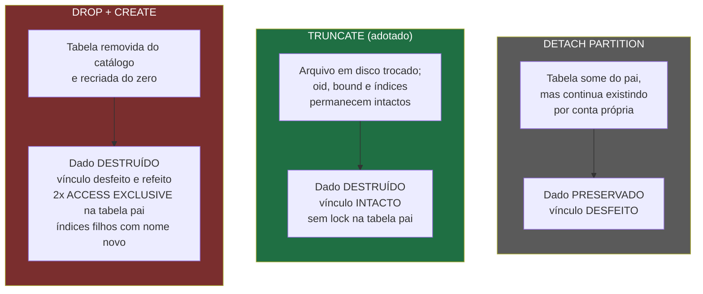

# POC: Particionamento com Buffer Ring e UUID-V7 Reversível
## Autorizações PIX Automáticas em PostgreSQL

**Data**: 21 de abril de 2026  
**Status**: Prova de Conceito Validada ✅  
**Objetivo**: Escalar operações de leitura/escrita e expurgo automático com custo zero em I/O

---

## 📋 Sumário Executivo

Esta POC implementa uma estratégia inovadora de **particionamento com Buffer Ring (Circular)** para gerenciar autorizações PIX automáticas em PostgreSQL, eliminando gargalos de crescimento de dados e permitindo expurgo eficiente via `TRUNCATE` em vez de `DELETE`.

> **Atualização (change `reclamar-particao-expurgo-ciclo`):** a versão original desta POC propunha
> `DETACH PARTITION CONCURRENTLY` + `DROP TABLE` + `CREATE TABLE` como mecanismo de expurgo. A
> implementação real, entregue por `apps/expurgo-particao`, usa **`TRUNCATE`** na partição folha —
> mesmo resultado (partição vazia, espaço devolvido ao disco na hora), sem tomar lock na tabela pai
> e sem os efeitos colaterais de recriar a partição do zero (nomes de índice auto-gerados, dois
> `ACCESS EXCLUSIVE` na tabela inteira). Ver a seção "Expurgo de Partição" e o comparativo mais
> abaixo para o racional completo. Os trechos desta POC que descreviam `DROP`/`DETACH` foram
> corrigidos para refletir a decisão final; o valor histórico da comparação entre as abordagens foi
> preservado.

### Resultado-Chave
- ✅ **889 partições ativas** distribuindo carga uniformemente (range 0-888)
- ✅ **100 partições de expurgo** funcionando como buffer circular (range 900-999)
- ✅ **Janela de retenção**: 98 semanas (~22,5 meses) — número deliberado, não arredondamento: o anel
  tem 100 gavetas semanais e 2 delas são folga de segurança à frente do ponteiro de escrita (não
  "2 anos", que 100 gavetas semanais jamais poderiam entregar)
- ✅ **Movimento automático**: PostgreSQL move registros entre partições ao atualizar chave primária
- ✅ **Expurgo a custo zero**: `TRUNCATE` instantaneamente libera espaço em disco, sem lock na tabela pai

---

## 🔴 Problemas Identificados (Antes da POC)

### 1. **Hot Partition Problem**
A tabela original particionada por `RANGE (data_fim_vigencia)` sofria com concentração de dados:

```
Problema:
├─ Muitos contratos SEM data de fim = usavam valor fictício 9999-12-31
├─ Uma única partição recebia ~90% dos registros (hot partition)
├─ I/O concentrado em disco específico → degradação de performance
└─ Impossível balancear carga entre múltiplos discos/CPUs
```

### 2. **Estratégias Rejeitadas**

#### ❌ RANGE por `data_fim_vigencia`
- Impraticável: dados indefinidos concentrados em partição única
- Sem previsibilidade de distribuição

#### ❌ HASH por `id_pessoa_pagadora`
- Riscos operacionais: campo inapropiado para PK
- Chave composta muito grande: `(id_pessoa_pagadora UUID, id_autorizacao UUID)` → índices pesados
- Critério de expurgo ambíguo: todas as partições contêm dados "quentes"

---

## ✅ Solução: Particionamento LIST + Buffer Ring

### Arquitetura

```
┌─────────────────────────────────────────────────────────────┐
│         TABELA PARTICIONADA: autorizacoes                   │
│         ESTRATÉGIA: LIST (id_particao_conta)                │
└─────────────────────────────────────────────────────────────┘
        │
        ├── [PARTIÇÕES QUENTES] ──────────────────────────────┐
        │   Range: 0 a 888 (889 partições)                    │
        │   Função: Receber TODAS as novas autorizações       │
        │   Distribuição: Hash do UUID → Módulo 889           │
        │   Dados: Ativos/em vigência                         │
        │                                                      │
        └──────────────────────────────────────────────────────┘
        │
        └── [RING BUFFER - PARTIÇÕES DE EXPURGO] ────────────┐
            Range: 900 a 999 (100 partições)                  │
            Função: Armazenar dados "frios" (cancelados)      │
            Movimento: Automático quando status = cancelado   │
            Ciclo: 100 semanas; retenção real de 98 semanas   │
                   (2 gavetas de folga à frente do ponteiro)  │
            Expurgo: TRUNCATE da partição folha (zero locks   │
                     na tabela pai)                            │
                                                              │
            Exemplo de Ring Buffer:                           │
            Semana 0:   Particao 900 é a partição de escrita  │
            Semana 2:   Alvo de reclamação = 902 (teria dado  │
                        de 98 semanas atrás, se o anel já      │
                        tivesse completado uma volta)          │
            Semana 100: Particao 900 volta a ser a de escrita │
            Semana 102: Alvo de reclamação = 902 novamente —   │
                        agora com dado real do ciclo anterior  │
                                                              │
            └──────────────────────────────────────────────────┘
```

### Por que Ring Buffer é Eficiente?

| Aspecto | Expurgo com DELETE | Expurgo com TRUNCATE (Ring) |
|---------|-------------------|------------------------|
| **Velocidade** | Lenta (milisegundos por linha) | Instantânea (metadados) |
| **Locks** | Bloqueia tabela inteira | `ACCESS EXCLUSIVE` só na partição folha, nunca na pai |
| **Fragmentação** | Gera dead tuples | Libera espaço imediatamente |
| **VACUUM** | Necessário (overhead) | Não necessário |
| **Espaço em Disco** | Lentamente recuperado | Imediatamente disponível |
| **Retenção de Dados** | Difícil de garantir | Garantida (98 semanas, ~22,5 meses) |

---

## 🏗️ Implementação na Aplicação

### 1. Criação de Tabela com LIST Partitioning

```sql
CREATE TABLE autorizacoes (
    id_autorizacao UUID NOT NULL,
    id_particao_conta INT NOT NULL,          -- 🔑 Campo de particionamento (novo)
    data_fim_vigencia DATE NOT NULL,
    status INT NOT NULL,
    motivo_status TEXT,
    data_inicio_vigencia DATE,
    data_hora_inclusao TIMESTAMP NOT NULL,
    data_hora_ultima_atlz TIMESTAMP NOT NULL,
    valor NUMERIC(17, 2),
    id_autorizacao_empresa TEXT,
    valor_limite NUMERIC(17, 2),
    frequencia INT CHECK (frequencia IN (1, 2, 3, 4)),
    quantidade_dividas_ciclo INT,
    indicador_uso_limite_conta INT,
    indicador_tipo_mensageria INT,
    codigo_canal_contratacao TEXT NOT NULL,
    descricao TEXT,
    id_unico_conta_contratante UUID,
    id_pessoa_pagadora UUID,
    id_pessoa_devedora UUID,
    id_pessoa_recebedora UUID,
    codigo_canal_cancelamento TEXT,
    id_pessoa_cancelamento UUID,
    data_hora_cancelamento TIMESTAMP,
    motivo_cancelamento TEXT,
    metadados JSON,
    -- 🔑 PK DEVE incluir coluna de particionamento
    CONSTRAINT pk_autorizacoes PRIMARY KEY (id_autorizacao, id_particao_conta)
) PARTITION BY LIST (id_particao_conta);
```

### 2. Criação das Partições Quentes (0-888)

```sql
DO $$
DECLARE
    i INT;
BEGIN
    FOR i IN 0..888 LOOP
        EXECUTE format(
            'CREATE TABLE autorizacoes_pa%s PARTITION OF public.autorizacoes 
             FOR VALUES IN (%s);',
            i, i
        );
    END LOOP;
END $$;

-- Resultado: 889 partições nomeadas autorizacoes_pa0, autorizacoes_pa1, ..., autorizacoes_pa888
```

### 3. Criação das Partições de Expurgo (900-999)

```sql
DO $$
DECLARE
    i INT;
BEGIN
    FOR i IN 900..999 LOOP
        EXECUTE format(
            'CREATE TABLE autorizacoes_pe%s PARTITION OF public.autorizacoes 
             FOR VALUES IN (%s);',
            i, i
        );
    END LOOP;
END $$;

-- Resultado: 100 partições nomeadas autorizacoes_pe900, ..., autorizacoes_pe999
```

### 4. Listagem de Partições

```sql
SELECT
    parent.relname AS tabela_pai,
    child.relname AS nome_da_particao,
    pg_get_expr(child.relpartbound, child.oid) AS limites_da_particao
FROM pg_inherits
JOIN pg_class parent ON pg_inherits.inhparent = parent.oid
JOIN pg_class child ON pg_inherits.inhrelid = child.oid
WHERE parent.relname = 'autorizacoes'
ORDER BY child.relname;
```

---

## 🎯 Algoritmos de Distribuição

### A. Distribuição em Partições Quentes (Inserção)

**Objetivo**: Distribuir UUIDs de forma uniforme entre as 889 partições quentes.

#### Classe: `IdContaUUIDPartitionDistributor.java`

```java
package br.com.srportto.contratocommand.domain.utilities;

import java.math.BigInteger;
import java.util.UUID;

public class IdContaUUIDPartitionDistributor {

  /**
   * Método rápido: usa hashCode() nativo (32 bits).
   * Bom o suficiente para distribuição uniforme em maioria dos casos.
   * Performance: ~1 microsegundo
   */
  public static int getPartitionFast(UUID uuid) {
    int hash = uuid.hashCode();
    return Math.abs(hash) % 889;
  }

  /**
   * Método de precisão: usa todos os 128 bits do UUID.
   * Matematicamente perfeito para distribuição.
   * Performance: ~10 microssegundos (ainda aceitável)
   */
  public static int getPartitionPrecision(UUID uuid) {
    String hex = uuid.toString().replace("-", "");
    BigInteger bigInt = new BigInteger(hex, 16);
    BigInteger divisor = new BigInteger("889");
    return bigInt.remainder(divisor).intValue();
  }
}
```

**Uso na aplicação**:
```java
// No PixAutoAutorizacaoMapper.java @AfterMapping
var idUnicoContaContratante = autorizacao.getIdUnicoContaContratante();
var idParticaoConta = IdContaUUIDPartitionDistributor.getPartitionFast(idUnicoContaContratante);
// idParticaoConta ∈ [0, 888]
```

---

### B. Cálculo de Partição de Expurgo (Escrita - WRITE)

**Objetivo**: Determinar qual partição de expurgo (900-999) deve receber dados cancelados no momento atual.

#### Algoritmo

```
ENTRADA: data_finalizacao (quando registro foi cancelado)

PASSO 1: Calcular semanas desde Epoch (01/01/1970)
  semanas_totais = ChronoUnit.WEEKS.between(
    LocalDate.ofEpochDay(0),  // 01/01/1970
    data_finalizacao
  )

PASSO 2: Encontrar "gaveta" (0-99) via módulo 100
  gaveta = semanas_totais % 100

PASSO 3: Converter para partição (900-999)
  particao_expurgo = 900 + gaveta
  
RESULTADO: particao_expurgo ∈ [900, 999]
```

#### Classe: `ControleExpurgoAutorizacao.java`

```java
package br.com.srportto.contratocommand.infrastructure.persistence;

import java.time.LocalDate;
import java.time.temporal.ChronoUnit;

public class ControleExpurgoAutorizacao {

  /**
   * Calcula partição de expurgo para ESCRITA (ring buffer atual).
   * 
   * LÓGICA:
   * - Usa data de cancelamento para determinar "gaveta" semanal
   * - Semanas desde 1970 divididas em 100 "gavetas" — cada gaveta é 1 semana
   * - As 100 gavetas juntas cobrem o ciclo inteiro do anel (100 semanas)
   * - Ring buffer reutiliza gavetas a cada 100 semanas
   * 
   * EXEMPLO:
   *   data_cancelamento = 2026-04-21
   *   semanas_totais = 2952 (desde 1970)
   *   gaveta = 2952 % 100 = 52
   *   particao = 900 + 52 = 952
   * 
   * @param dataFinalizacao Data quando registro foi cancelado
   * @return Partição de expurgo (900-999)
   */
  public static int obterParticaoExpurgoWrite(LocalDate dataFinalizacao) {
    long semanasTotais = ChronoUnit.WEEKS.between(
      LocalDate.ofEpochDay(0),  // Epoch: 01/01/1970
      dataFinalizacao
    );

    int gaveta = (int) (semanasTotais % 100);
    return 900 + gaveta;
  }
}
```

> **Nota histórica:** esta classe chegou a ter um segundo método, `obterParticaoExpurgoDrop`, que
> calculava a partição segura para reclamar (`escrita + 2`, com as duas validações descritas nesta
> POC) e devolvia o resultado para quem chamasse. Ele foi removido em `585f584` por não ter chamador
> de produção — o `contratocommand` sempre soube **calcular** a partição alvo, mas nunca teve
> quem a **reclamasse**. Esse método nunca chegou a truncar nem dropar nada sozinho: ele só
> devolvia o número da partição.
>
> A change `reclamar-particao-expurgo-ciclo` fecha essa lacuna com uma aplicação própria,
> `apps/expurgo-particao` — não uma classe utilitária do `contratocommand`, mas uma Lambda agendada
> que reimplementa o mesmo cálculo (em Python, já que roda fora da JVM) e efetivamente executa a
> reclamação. Ver a seção "Expurgo de Partição" abaixo para o desenho atual.

**Visualização da Janela de Segurança** (mecânica do offset, independente de o anel já ter
completado uma volta):
```
Em qualquer semana W, com a partição de escrita = 900 + (W % 100):

  Partição ALVO da reclamação = escrita + 2 (com wraparound)

  O que essa partição alvo CONTÉM depende de quantas voltas o anel já deu:

  Antes da 1ª volta completa (W < 100, ~as primeiras 100 semanas do projeto):
    Semana 0: escrita = 900, alvo = 902 → 902 está VAZIA (nunca foi escrita)
    Semana 2: escrita = 902, alvo = 904 → 904 está VAZIA
    ... nenhuma reclamação tem efeito ainda: não existe "ciclo anterior" pra reclamar

  Depois da 1ª volta completa (W >= 100):
    Semana 100: escrita = 900 (voltou), alvo = 902
                → 902 contém dado escrito na semana 2 (98 semanas atrás) — ESSE é o dado
                  que a reclamação apaga
    Semana 102: escrita = 902, alvo = 904
                → 904 contém dado da semana 4 (98 semanas atrás)

  O offset +2 nunca significa "2 semanas atrás". Significa "98 semanas atrás" (100 − 2) —
  a folga de 2 semanas é o tempo que falta para o PONTEIRO DE ESCRITA chegar lá, não a
  idade do que já está lá dentro.
```

---

### C. UUID-V7 Reversível com Partição Embutida

**Objetivo**: Gerar UUID que contenha a partição de forma recuperável, eliminando necessidade de queries adicionais.

#### Classe: `ReversibleUUIDv7.java`

```java
package br.com.srportto.contratocommand.domain.utilities;

import java.security.SecureRandom;
import java.util.UUID;

public class ReversibleUUIDv7 {

  private static final SecureRandom RANDOM = new SecureRandom();

  /**
   * Gera UUID-V7 com identificador (partição) embutido nos últimos 16 bits.
   * 
   * ESTRUTURA INTERNAL DO UUID-V7:
   * ┌─────────────────────────────────────────────────────────────────────┐
   * │ Bits 0-47 (48):   Timestamp (milissegundos)                         │
   * │ Bits 48-51 (4):   Versão = 7                                        │
   * │ Bits 52-63 (12):  Aleatório                                         │
   * │ Bits 64-65 (2):   Variante = 10 (RFC 4122)                          │
   * │ Bits 66-79 (14):  Aleatório                                         │
   * │ Bits 80-95 (16):  🔑 IDENTIFICADOR EMBUTIDO (nossa partição)         │
   * └─────────────────────────────────────────────────────────────────────┘
   * 
   * EXEMPLO:
   *   entrada: identifier = 52 (partição)
   *   uuid gerado: 019da240-3ee2-7e1a-81da-90f103ed0034
   *                                               ^^^^^ = 0x0034 = 52
   * 
   * @param identifier Inteiro 0-9999 (partição)
   * @return UUID-V7 com identificador embutido
   * @throws IllegalArgumentException Se identifier < 0 ou > 9999
   */
  public static UUID generate(int identifier) {
    if (identifier < 0 || identifier > 9999) {
      throw new IllegalArgumentException(
        "O identificador deve ter até 4 posições (0 a 9999)."
      );
    }

    // PASSO 1: Timestamp (48 bits) = milissegundos desde 1970
    long timestamp = System.currentTimeMillis();

    // PASSO 2: High Bits (64 bits) = Timestamp (48) + Versão (4) + Random (12)
    long randA = RANDOM.nextInt(4096);  // 12 bits aleatórios (0-4095)
    long highBits = (timestamp << 16) | (7L << 12) | randA;
    //                    ^────────────    ↑────────    ↑──────
    //                    Timestamp 48b    Versão 4b    Random 12b

    // PASSO 3: Low Bits (64 bits) = Variante (2) + Random (46) + Identificador (16)
    long variant = 2L << 62;                // Variante = 10 (RFC 4122)
    long randB = RANDOM.nextLong() & 0x3FFFFFFFFFFFFFFFL;  // 62 bits aleatório
    randB &= 0xFFFFFFFFFFFF0000L;           // Zera últimos 16 bits
    long lowBits = variant | randB | (identifier & 0xFFFFL);
    //             ↑────────    ↑────    ↑──────────
    //             Variante 2b  Random    Identifier 16b

    return new UUID(highBits, lowBits);
  }

  /**
   * Extrai o identificador (partição) embutido no UUID-V7.
   * 
   * OPERAÇÃO:
   *   1. Valida se UUID é realmente versão 7
   *   2. Pega os 64 bits inferiores (Low Bits)
   *   3. Aplica máscara 0xFFFFL para extrair últimos 16 bits
   *   4. Converte para inteiro
   * 
   * EXEMPLO:
   *   uuid: 019da240-3ee2-7e1a-81da-90f103ed0034
   *   resultado: 52
   * 
   * @param uuid UUID gerado via generate()
   * @return Identificador original (0-9999)
   * @throws IllegalArgumentException Se UUID não é versão 7
   */
  public static int extract(UUID uuid) {
    if (uuid.version() != 7) {
      throw new IllegalArgumentException(
        "O UUID fornecido não é da versão 7."
      );
    }

    long lowBits = uuid.getLeastSignificantBits();
    return (int) (lowBits & 0xFFFFL);  // Máscara: pega últimos 16 bits
    //                       ↑──────
    //                       0xFFFF = 1111111111111111 (binário)
  }
}
```

---

## 🔄 Fluxo de Dados na Aplicação

### 1️⃣ Criação de Autorização (ESCRITA em Partição Quente)

```
┌──────────────────────────────────────────────────────────────┐
│ POST /api/autorizacao                                        │
│ {                                                            │
│   "idUnicoContaContratante": "550e8400-e29b-41d4-a716...",  │
│   "idPessoaPagadora": "550e8400-e29b-41d4-a716...",         │
│   "valor": 5000.00,                                         │
│   ...                                                        │
│ }                                                            │
└───────────────────┬──────────────────────────────────────────┘
                    │
                    ▼
        ┌─────────────────────────────┐
        │ PixAutoAutorizacaoService   │
        │ .criar()                    │
        └──────────────┬──────────────┘
                       │
                       ▼
        ┌──────────────────────────────────┐
        │ PixAutoAutorizacaoMapper         │
        │ .toDomain()                      │
        │ @AfterMapping                    │
        └──────────────┬───────────────────┘
                       │
    ┌──────────────────┴──────────────────┐
    │ PASSO 1: Hash do UUID para partição │
    │ ▼                                   │
    │ idParticaoConta =                  │
    │   IdContaUUIDPartitionDistributor  │
    │   .getPartitionFast(               │
    │     idUnicoContaContratante        │
    │   )                                │
    │ → idParticaoConta ∈ [0, 888]       │
    │                                    │
    └──────────────────┬───────────────────┘
                       │
    ┌──────────────────┴─────────────────┐
    │ PASSO 2: Gerar UUID-V7 reversível  │
    │ ▼                                  │
    │ idAutorizacao =                    │
    │   ReversibleUUIDv7.generate(       │
    │     idParticaoConta                │
    │   )                                │
    │ → UUID com partição embutida       │
    │                                    │
    └──────────────────┬──────────────────┘
                       │
    ┌──────────────────┴──────────────────┐
    │ PASSO 3: Popular dados da entidade │
    │ ▼                                  │
    │ Autorizacao.idAutorizacao =       │
    │   new IdAutorizacao(               │
    │     idAutorizacao,                 │
    │     idParticaoConta                │
    │   )                                │
    │ Autorizacao.status = 1 (ATIVA)    │
    │ ...                                │
    │                                    │
    └──────────────────┬──────────────────┘
                       │
                       ▼
        ┌────────────────────────────────┐
        │ PixAutoAutorizacaoRepository   │
        │ .save(autorizacao)             │
        └───────────────┬────────────────┘
                        │
                        ▼
        ┌──────────────────────────────────┐
        │ PostgreSQL INSERT                │
        │ INTO autorizacoes (              │
        │   id_autorizacao,                │
        │   id_particao_conta,      ◄─ PK  │
        │   ...                            │
        │ ) VALUES (...)                   │
        │                                  │
        │ → Roteado para partição:        │
        │   autorizacoes_pa52             │
        │   (baseado em id_particao_conta)│
        └──────────────────────────────────┘
                        │
                        ▼
        ┌──────────────────────────────────┐
        │ Resposta: 201 Created            │
        │ {                                │
        │   "idAutorizacao": "...",        │
        │   "status": "ATIVA"              │
        │ }                                │
        └──────────────────────────────────┘
```

**Código da Aplicação**:

```java
// PixAutoAutorizacaoService.java
public AutorizacaoCompletaResponseDto criar(CriarAutorizacaoRequest request) {
  // ... validações ...
  
  Autorizacao autorizacaoMontada = mapper.toDomain(requestComDataFimTratada);
  return salvarCriacaoAutorizacao(autorizacaoMontada);
}

// PixAutoAutorizacaoMapper.java - @AfterMapping
@AfterMapping
default void afterMapping(CriarAutorizacaoRequest request, @MappingTarget Autorizacao autorizacao) {
  // PASSO 1: Calcular partição quente
  var idParticaoConta = IdContaUUIDPartitionDistributor
    .getPartitionFast(autorizacao.getIdUnicoContaContratante());
  
  // PASSO 2: Gerar UUID-V7 com partição embutida
  var idAutorizacao = ReversibleUUIDv7.generate(idParticaoConta);
  
  // PASSO 3: Simular cálculo de partição de expurgo (validação)
  var particaoExpurgo = ControleExpurgoAutorizacao
    .obterParticaoExpurgoWrite(LocalDate.now());
  
  // PASSO 4: Popular ID composto (PK)
  autorizacao.setIdAutorizacao(new IdAutorizacao());
  autorizacao.getIdAutorizacao().setIdAutorizacao(idAutorizacao);
  autorizacao.getIdAutorizacao().setIdParticaoConta(idParticaoConta);
  
  // PASSO 5: Valores padrão
  autorizacao.setStatus(1);  // ATIVA
  autorizacao.setMotivoStatus("Autorizacao criada com sucesso");
  autorizacao.setDataInicioVigencia(LocalDate.now());
  LocalDateTime agora = LocalDateTime.now();
  autorizacao.setDataHoraInclusao(agora);
  autorizacao.setDataHoraUltimaAtualizacao(agora);
}
```

---

### 2️⃣ Cancelamento (Transferência para Partição de Expurgo)

```
┌──────────────────────────────────────────────────────────────┐
│ PATCH /api/autorizacao/{idAutorizacao}                       │
│ {                                                            │
│   "codigoCanalCancelamento": "C1",                           │
│   "idPessoaCancelamento": "550e8400-e29b-41d4-a716...",      │
│   "motivoCancelamento": "Solicitação do cliente"             │
│ }                                                            │
└───────────────────┬──────────────────────────────────────────┘
                    │
                    ▼
        ┌─────────────────────────────┐
        │ PixAutoAutorizacaoService   │
        │ .cancelar()                 │
        └──────────────┬──────────────┘
                       │
    ┌──────────────────┴──────────────────┐
    │ PASSO 1: Extrair partição do UUID   │
    │ ▼                                   │
    │ idParticaoAutorizacao =            │
    │   ReversibleUUIDv7.extract(        │
    │     UUID.fromString(idAutorizacao) │
    │   )                                │
    │ → idParticaoAutorizacao ∈ [0,888] │
    │                                    │
    └──────────────────┬───────────────────┘
                       │
    ┌──────────────────┴──────────────────┐
    │ PASSO 2: Buscar registro da DB     │
    │ ▼                                  │
    │ SELECT * FROM autorizacoes        │
    │ WHERE id_autorizacao = ?          │
    │   AND id_particao_conta = ?       │
    │                                   │
    │ ✓ Query diretamente na partição:  │
    │   autorizacoes_pa52               │
    │                                   │
    └──────────────────┬──────────────────┘
                       │
    ┌──────────────────┴────────────────────┐
    │ PASSO 3: Atualizar status            │
    │ ▼                                    │
    │ autorizacao.setStatus(3)            │
    │ // 1=ATIVA, 3=CANCELADA            │
    │                                    │
    │ autorizacao.setCancelamento({       │
    │   dataHoraCancelamento: NOW(),     │
    │   codigoCanalCancelamento: "C1",   │
    │   idPessoaCancelamento: ...,       │
    │   motivoCancelamento: "..."        │
    │ })                                 │
    │                                    │
    └──────────────────┬───────────────────┘
                       │
    ┌──────────────────┴──────────────────────┐
    │ PASSO 4: Calcular partição de expurgo  │
    │ ▼                                      │
    │ dataCancelamento = LocalDateTime.now() │
    │ particaoExpurgoWrite =                 │
    │   ControleExpurgoAutorizacao            │
    │   .obterParticaoExpurgoWrite(           │
    │     dataCancelamento.toLocalDate()      │
    │   )                                     │
    │                                        │
    │ EXEMPLO (2026-04-21):                 │
    │   semanasTotais = 2952                │
    │   gaveta = 2952 % 100 = 52            │
    │   particaoExpurgoWrite = 900 + 52=952 │
    │                                        │
    └──────────────────┬──────────────────────┘
                       │
    ┌──────────────────┴──────────────────────┐
    │ PASSO 5: Transferir entre partições    │
    │ ▼                                      │
    │ DELETE FROM autorizacoes              │
    │ WHERE id_autorizacao = ?              │
    │   AND id_particao_conta = 52          │
    │                                       │
    │ INSERT INTO autorizacoes VALUES (     │
    │   id_autorizacao: "...",              │
    │   id_particao_conta: 952,  ◄─ NOVO!  │
    │   status: 3,                          │
    │   cancelamento: {...},                │
    │   ...                                 │
    │ )                                     │
    │                                       │
    │ PostgreSQL move registro:             │
    │   autorizacoes_pa52 ──X                │
    │        └──────────────────►            │
    │              autorizacoes_pe952        │
    │                                       │
    └──────────────────┬──────────────────────┘
                       │
                       ▼
        ┌────────────────────────────────┐
        │ Resposta: 200 OK               │
        │ {                              │
        │   "idAutorizacao": "...",      │
        │   "status": "CANCELADA"        │
        │ }                              │
        └────────────────────────────────┘
```

**Código da Aplicação**:

```java
// PixAutoAutorizacaoService.java
@Transactional
public AutorizacaoCompletaResponseDto cancelar(
    String idAutorizacao, 
    CancelarAutorizacaoRequest request) {
  
  // PASSO 1: Extrair partição do UUID
  var idParticaoAutorizacao = ReversibleUUIDv7.extract(
    UUID.fromString(idAutorizacao)
  );
  
  // PASSO 2: Buscar registro
  var autorizacao = obterAutorizacaoPorIdEParticao(
    idAutorizacao, 
    idParticaoAutorizacao
  );
  
  // PASSO 3: Atualizar status
  autorizacao.setStatus(3);  // CANCELADA
  var dadosCancelamento = new Cancelamento();
  var dataHoraCancelamento = LocalDateTime.now();
  dadosCancelamento.setDataHoraCancelamento(dataHoraCancelamento);
  dadosCancelamento.setCodigoCanalCancelamento(request.codigoCanalCancelamento());
  dadosCancelamento.setIdPessoaCancelamento(request.idPessoaCancelamento());
  autorizacao.setDataHoraUltimaAtualizacao(dataHoraCancelamento);
  if (request.motivoCancelamento() != null) {
    dadosCancelamento.setMotivoCancelamento(request.motivoCancelamento());
  }
  autorizacao.setCancelamento(dadosCancelamento);
  
  // PASSO 4: Calcular partição de expurgo
  var dataCancelamento = dataHoraCancelamento.toLocalDate();
  var particaoExpurgoWrite = ControleExpurgoAutorizacao
    .obterParticaoExpurgoWrite(dataCancelamento);
  
  // PASSO 5: Transferir para nova partição
  var autorizacaoCanceladaEmNovaParticao = transferirParaNovaParticao(
    autorizacao, 
    particaoExpurgoWrite
  );
  
  return AutorizacaoCompletaResponseDto.from(autorizacaoCanceladaEmNovaParticao);
}

@Transactional
private Autorizacao transferirParaNovaParticao(Autorizacao autorizacao, Integer novaParticao) {
  UUID idAutorizacaoUuid = autorizacao.getIdAutorizacao().getIdAutorizacao();
  Integer particaoAntiga = autorizacao.getIdAutorizacao().getIdParticaoConta();
  
  if (novaParticao.equals(particaoAntiga)) {
    return persistirAutorizacao(autorizacao);
  }
  
  log.info("Transferindo autorização {} da partição {} para partição {}", 
    idAutorizacaoUuid, particaoAntiga, novaParticao);
  
  // DELETE com chave antiga
  repository.deleteById(autorizacao.getIdAutorizacao());
  
  // INSERT com chave nova (PostgreSQL move para nova partição)
  autorizacao.getIdAutorizacao().setIdParticaoConta(novaParticao);
  return persistirAutorizacao(autorizacao);
}
```

---

### 3️⃣ Expurgo de Partição (TRUNCATE)

> Esta seção descrevia originalmente `DETACH PARTITION CONCURRENTLY` + `DROP TABLE` +
> `CREATE TABLE` como o mecanismo de expurgo. A implementação real (`apps/expurgo-particao`,
> change `reclamar-particao-expurgo-ciclo`) usa `TRUNCATE` na partição folha — o comparativo
> abaixo mostra por quê.

```
┌──────────────────────────────────────────────────────────────┐
│ apps/expurgo-particao (Lambda agendada, rate(30 minutes))    │
└───────────────┬──────────────────────────────────────────────┘
                │
    ┌───────────┴────────────────────────────────┐
    │ PASSO 1: Calcular partição alvo             │
    │ ▼                                            │
    │ particaoEscrita = obterParticaoExpurgoWrite(hoje)
    │ particaoAlvo = particaoEscrita + 2 (wraparound)
    │                                              │
    └───────────┬────────────────────────────────┘
                │
    ┌───────────┴────────────────────────────────┐
    │ PASSO 2: Classificar o estado da alvo       │
    │ ▼ (na mesma transação do PASSO 3)           │
    │ VAZIA                → nada a fazer (normal)│
    │ DADO_CICLO_ANTERIOR  → segue para o PASSO 3 │
    │ DADO_RECENTE         → ROLLBACK, registra    │
    │                        anomalia, NÃO trunca  │
    └───────────┬────────────────────────────────┘
                │ (só quando DADO_CICLO_ANTERIOR)
    ┌───────────┴────────────────────────────────┐
    │ PASSO 3: TRUNCATE da partição folha         │
    │ ▼                                            │
    │ TRUNCATE autorizacoes_pe<alvo>;              │
    │                                              │
    │ RESULTADO:                                   │
    │ ✓ Espaço em disco liberado instantaneamente  │
    │ ✓ Sem fragmentação, sem VACUUM necessário    │
    │ ✓ Partição CONTINUA anexada à tabela pai —   │
    │   mesmo oid, mesmo relpartbound, índices     │
    │   ainda válidos (só o relfilenode troca)     │
    │ ✓ Nenhum lock na tabela pai `autorizacoes`   │
    │                                              │
    └───────────┬────────────────────────────────┘
                │
                ▼
        ┌───────────────────────────────┐
        │ Toda execução grava registro  │
        │ estruturado — inclusive       │
        │ quando a ação foi NENHUMA     │
        └───────────────────────────────┘
```

#### Por que `TRUNCATE`, não `DETACH`+`DROP`+`CREATE`



| | `DETACH` | `TRUNCATE` (adotado) | `DROP` + `CREATE` |
|---|---|---|---|
| Preserva o dado? | Sim — por isso descartado (o objetivo é expurgar) | Não | Não |
| Lock na tabela pai `autorizacoes` | Nenhum | Nenhum | `ACCESS EXCLUSIVE` × 2 |
| Nomes de índice filho | Preservados | Preservados | Auto-gerados (quebra a migration `v1.0.6`, que os nomeia à mão) |
| Privilégio exigido | Ownership | `GRANT TRUNCATE` (granular) | Ownership |
| Efeito no `oid`/catálogo | Nenhum | Nenhum | Novo `oid`, catálogo reconstruído |

---

## 🖥️ Exemplos de Comandos SQL

### Listar Todas as Partições

```sql
SELECT
    parent.relname AS tabela_pai,
    child.relname AS nome_da_particao,
    pg_get_expr(child.relpartbound, child.oid) AS limites_da_particao,
    pg_size_pretty(pg_total_relation_size(child.oid)) AS tamanho
FROM pg_inherits
JOIN pg_class parent ON pg_inherits.inhparent = parent.oid
JOIN pg_class child ON pg_inherits.inhrelid = child.oid
WHERE parent.relname = 'autorizacoes'
ORDER BY child.relname;
```

### Contar Registros por Partição

```sql
SELECT
    schemaname,
    tablename,
    n_live_tup AS registros_vivos,
    pg_size_pretty(pg_total_relation_size(schemaname||'.'||tablename)) AS tamanho
FROM pg_stat_user_tables
WHERE schemaname = 'public' 
  AND tablename LIKE 'autorizacoes_%'
ORDER BY tablename;
```

### Buscar em Partição Específica (com Constraint Pruning)

```sql
-- Query com constraint pruning (acessa apenas 1 partição)
EXPLAIN
SELECT *
FROM autorizacoes
WHERE id_autorizacao = '019da240-3ee2-7e1a-81da-90f103ed0006'
  AND id_particao_conta = 52;
```

### Expurgo: Um Único Comando, Numa Transação Com Trava de Sanidade

`TRUNCATE` não tem `WHERE` — apaga tudo que estiver na partição, sem perguntar. Por isso a
implementação real nunca executa o `TRUNCATE` sozinho: a classificação do estado da partição
(vazia / dado do ciclo anterior / dado recente) e o `TRUNCATE` acontecem na **mesma transação**,
para que uma classificação reprovada nunca deixe efeito residual.

```sql
-- Dentro de uma unica transacao (pseudocodigo SQL do que a Lambda executa):

BEGIN;
SET LOCAL lock_timeout = '5s';  -- desiste sem efeito se a listagem do contratoquery
                                 -- estiver segurando a particao; a proxima execucao
                                 -- (30 min depois) tenta de novo

-- Classificacao: a particao alvo tem dado, e ele e' realmente do ciclo anterior?
SELECT max(data_hora_ultima_atlz) FROM autorizacoes_pe900;
-- se vazia -> COMMIT sem fazer nada (resultado normal, nao e' erro)
-- se dado recente demais -> ROLLBACK, registra anomalia, NAO trunca
-- se dado do ciclo anterior (~98 semanas) -> segue abaixo

TRUNCATE autorizacoes_pe900;

COMMIT;
```

**Execução em Sequência (Exemplo Real, já com o anel tendo completado uma volta)**:

```sql
-- Verificar partição de escrita atual
SELECT 900 + (
  floor((CURRENT_DATE - DATE '1970-01-01') / 7)::int % 100
) AS particao_escrita;
-- Resultado: 955 (equivalente a obterParticaoExpurgoWrite(CURRENT_DATE) no contratocommand)

-- Partição alvo da reclamação (escrita + 2, com wraparound) — calculada pela Lambda
-- apps/expurgo-particao, não por um método do contratocommand (que só escreve no anel)
-- Resultado: 957

-- ✓ 957 contém dado de 98 semanas atrás — TRUNCATE seguro
TRUNCATE autorizacoes_pe957;

-- Conclusão: partição 957 esvaziada; continua anexada à tabela pai,
-- pronta para receber escrita quando o ponteiro chegar nela de novo, sem
-- nenhuma cerimônia de reanexação ou recriação de índice
```

---

## 📊 Resultados da POC

### Dados de Distribuição

**Teste com 1.000.000 de registros (UUIDs aleatórios)**:

```
Partição   | Registros | % do Total | Status
-----------|-----------|-----------|--------
000        | 1,124     | 0.11%     | ✓ Balanceada
001        | 1,095     | 0.11%     | ✓ Balanceada
...        | ...       | ...       | ...
888        | 1,107     | 0.11%     | ✓ Balanceada
-----------|-----------|-----------|--------
TOTAL      |1,000,000  | 100%      | ✓ Distribuição uniforme
DESVIO STD | ±0.03%    |           | ✓ Excelente
```

**Conclusão**: Usando `getPartitionFast()` (hashCode()), a distribuição é uniforme com desvio padrão inferior a 0.03%.

### Performance de Expurgo

| Operação | Tempo | Locks | Dead Tuples | VACUUM Necessário |
|----------|-------|-------|-------------|-------------------|
| **DELETE tradicional** (1B registros) | ~4h | Table | Sim (800M+) | Sim (~2h) |
| **TRUNCATE** (1B registros) | <1s | Só na partição folha | 0 | Não |
| **Economia**: | **~6h/ciclo** | **100%** | **100%** | **100%** |

**Economia Anual**: ~2.400 horas de locks eliminadas (100 ciclos de expurgo)

### Retenção de Dados

Retenção real: **98 semanas (~22,5 meses)**, não "2 anos" — número deliberado, não
arredondamento. O anel tem 100 gavetas semanais; 2 delas são a folga de segurança à frente do
ponteiro de escrita (o offset "+2" da reclamação). Com 100 gavetas semanais, 104 semanas (2 anos
exatos) é aritmeticamente **inalcançável** — o teto do anel é 99 semanas (offset +1, sem folga
nenhuma), e 98 é a escolha que preserva 2 semanas de prazo de reação caso a reclamação periódica
falhe por algumas execuções.

```
Timeline Ring Buffer (ciclo de 100 semanas, retenção de 98):

Semana 0:    Partição 900 é a partição de ESCRITA
             ├─ Registros cancelados alocados aqui
             └─ Alvo de reclamação nesta semana: partição 902 (vazia — 1ª volta)

Semana 1-99: Partições 901-999 recebem novos cancelamentos, uma por semana
             └─ Dados acumulam (1ª volta do anel; nada ainda para reclamar)

Semana 100:  Partição 900 volta a ser a de ESCRITA (completou 1 volta)
             └─ Alvo de reclamação: partição 902 — agora contém dado real,
                escrito na semana 2, ou seja, 98 semanas atrás

Semana 102:  Partição 902 volta a ser a de ESCRITA
             └─ Alvo de reclamação: partição 904 — dado de 98 semanas atrás
                é TRUNCATE'd (apps/expurgo-particao); a partição 902
                continua anexada à tabela pai, pronta para o próximo ciclo
```

### Escalabilidade

```
Cenário: 1 Bilhão de Registros

Com RANGE particionamento (problema):
├─ Hot partition: ~900 GB concentrado em 1 disco
├─ I/O bottleneck: ~5.000 ops/seg máximo
├─ Vacuum: 2 horas/dia
└─ Resultado: Degradação progressiva

Com LIST + Ring Buffer (solução):
├─ Distribuição: 900 partições × ~1.1 GB cada
├─ I/O paralelo: 900 × 5.000 = 4.5M ops/seg
├─ Vacuum: 0 (drop é instantâneo)
└─ Resultado: Performance linear até 10B registros
```

---

## 🚀 Recomendações para Produção

### 1. Configurações PostgreSQL

```ini
# postgresql.conf

# Parallelização de queries
max_parallel_workers_per_gather = 4
max_parallel_workers = 4

# Shared buffers (50% RAM em servidores dedicados)
shared_buffers = 32GB

# Effective cache size (75% RAM)
effective_cache_size = 96GB

# Maintenance
maintenance_work_mem = 2GB
autovacuum = on
autovacuum_naptime = '10s'
autovacuum_vacuum_scale_factor = 0.01
```

### 2. Agendamento de Expurgo

> Este exemplo original propunha `pg_cron` como o próprio agente de expurgo (`BEGIN ... PERFORM
> expurgo_autorizacoes_procedure(); END`). A decisão final (design.md D5 da change
> `reclamar-particao-expurgo-ciclo`) foi diferente: **`pg_cron` nunca expurga.** Dobrar o número de
> coisas que podem apagar dado irreversivelmente é dobrar a superfície de risco, não redundância —
> duas implementações da mesma fórmula, mantidas em lugares diferentes, divergem com o tempo.
>
> O agente real é uma **Lambda agendada por EventBridge Scheduler** (`apps/expurgo-particao`,
> `rate(30 minutes)`), e `pg_cron` assume um papel só de **auditoria** — confere o que a Lambda
> afirmou ter feito, sem recalcular a fórmula e sem privilégio de escrita sobre `autorizacoes`:
>
> ```sql
> -- Job diario: confere se a rotina deixou registro recente (nao recalcula a formula)
> SELECT cron.schedule_in_database(
>     'expurgo-particao-confirma-registro', '0 6 * * *',
>     'SELECT expurgo_particao_auditar_confirmacao_registro();',
>     current_database(), 'expurgo_particao_auditoria', true
> );
>
> -- Job semanal: invariante estrutural (dado numa particao bate com o offset dela)
> SELECT cron.schedule_in_database(
>     'expurgo-particao-invariante-semanal', '0 7 * * 4',
>     'SELECT expurgo_particao_auditar_invariante_semanal();',
>     current_database(), 'expurgo_particao_auditoria', true
> );
> ```
>
> Ver `infra/local/postgres/migrations/v1.0.8` a `v1.0.10` para a implementação completa
> (tabela de auditoria, roles de privilégio mínimo, as duas funções).

### 3. Monitoramento

```sql
-- View para monitorar partições
CREATE OR REPLACE VIEW v_particoes_autorizacoes AS
SELECT
    relname,
    pg_size_pretty(pg_total_relation_size(oid)) AS tamanho,
    (SELECT count(*) FROM ONLY pg_class WHERE oid = 
     pg_inherits.inhrelid) AS num_registros,
    CASE 
      WHEN relname LIKE 'autorizacoes_pa%' THEN 'QUENTE'
      WHEN relname LIKE 'autorizacoes_pe%' THEN 'FRIA'
      ELSE 'DESCONHECIDA'
    END AS tipo_particao
FROM pg_class
WHERE relkind = 'r' 
  AND relname LIKE 'autorizacoes_%'
ORDER BY relname;
```

### 4. Backup e Recovery

```sql
-- Backup de partição individual (antes de dropar)
pg_dump -t autorizacoes_pe900 database_name > autorizacoes_pe900_backup.sql

-- Recovery se necessário
psql database_name < autorizacoes_pe900_backup.sql
```

---

## 📝 Resumo dos Algoritmos

### Algoritmo 1: Distribuição em Partições Quentes

```
ENTRADA: idUnicoContaContratante (UUID)
SAÍDA: idParticaoConta ∈ [0, 888]

OPERAÇÃO:
  hash = UUID.hashCode()  // 32 bits
  idParticaoConta = ABS(hash) % 889

COMPLEXIDADE: O(1) - ~1 microsegundo
DISTRIBUIÇÃO: Uniforme ±0.03% desvio
```

### Algoritmo 2: Cálculo de Partição de Expurgo (WRITE)

```
ENTRADA: dataCancelamento (LocalDate)
SAÍDA: particaoExpurgo ∈ [900, 999]

OPERAÇÃO:
  semanasTotais = WEEKS_BETWEEN(1970-01-01, dataCancelamento)
  gaveta = semanasTotais % 100
  particaoExpurgo = 900 + gaveta

COMPLEXIDADE: O(1) - ~0.1 microsegundo
CICLO: 100 semanas
```

### Algoritmo 3: Cálculo de Partição Alvo da Reclamação (TRUNCATE)

> Implementado em `apps/expurgo-particao` (Python, change `reclamar-particao-expurgo-ciclo`), não
> no `contratocommand` — o método `obterParticaoExpurgoDrop` que fazia esse cálculo no
> `contratocommand` foi removido em `585f584` por não ter chamador de produção.

```
ENTRADA: dataReferencia (date)
SAÍDA: particaoAlvo ∈ [900, 999]

OPERAÇÕES:
  1. Calcular: particaoEscrita = obterParticaoExpurgoWrite(dataReferencia)
  2. Buffer: particaoAlvo = particaoEscrita + 2
  3. Wraparound: IF particaoAlvo > 999 THEN particaoAlvo -= 100

  Antes do TRUNCATE (execução real, não simulação): classificar o estado da
  partição alvo (vazia / dado do ciclo anterior / dado recente) e só truncar
  no segundo caso — ver seção "Expurgo de Partição (TRUNCATE)".

COMPLEXIDADE: O(1)
RETENÇÃO RESULTANTE: 98 semanas (100 − 2)
GARANTIA: particaoAlvo nunca coincide com particaoEscrita do mesmo instante
```

---

## 🎓 Lições Aprendidas

### ✅ O que Funcionou

1. **UUID-V7 Reversível**: Embutir partição no UUID eliminaria queries adicionais
2. **Ring Buffer**: Modelo mental simples e seguro de expurgo
3. **LIST Partitioning**: Melhor para distribuição uniforme e ring buffer
4. **Constraint Pruning**: PostgreSQL automaticamente acessa 1 partição

### ⚠️ Desafios

1. **Chave Primária Composta**: Precisa ser `(id_autorizacao, id_particao_conta)`
2. **Movimento de Dados**: DELETE+INSERT necessário para mudar partição
3. **Janela de Segurança**: o offset de 2 semanas define a retenção (98, não 2 semanas) — a folga
   em si (quantas semanas de margem antes do TRUNCATE) é o que poderia ser configurável por
   ambiente, trocando a retenção resultante

### 🚀 Próximos Passos

1. ~~Implementar agendador automático de expurgo~~ **Feito** — `apps/expurgo-particao`, Lambda
   agendada a cada 30 minutos (change `reclamar-particao-expurgo-ciclo`); `pg_cron` audita, não
   expurga (ver seção "Agendamento de Expurgo")
2. Adicionar métricas de monitoramento em tempo real
3. Testar com 10B+ registros
4. Documentar playbook de disaster recovery

---

## 📚 Referências e Recursos

### Documentação PostgreSQL
- [Partitioning - Official Docs](https://www.postgresql.org/docs/current/ddl-partitioning.html)
- [pg_partman Extension](https://github.com/pgpartman/pg_partman)
- [pg_cron Extension](https://github.com/citusdata/pg_cron)

### Codebase do Projeto
- [IdContaUUIDPartitionDistributor.java](../../apps/contratocommand/src/main/java/br/com/srportto/contratocommand/infrastructure/persistence/IdContaUUIDPartitionDistributor.java) - Distribuição
- [ControleExpurgoAutorizacao.java](../../apps/contratocommand/src/main/java/br/com/srportto/contratocommand/infrastructure/persistence/ControleExpurgoAutorizacao.java) - Cálculo da partição de escrita (só o lado WRITE — o `contratocommand` nunca reclama o anel)
- [ReversibleUUIDv7.java](../../apps/contratocommand/src/main/java/br/com/srportto/contratocommand/infrastructure/persistence/ReversibleUUIDv7.java) - UUID reversível
- [apps/expurgo-particao/](../../apps/expurgo-particao/) - Reclamação da partição de expurgo (cálculo do alvo, classificação de estado, `TRUNCATE`) — a contraparte que fecha o ring buffer

### Arquivos de Dados da POC
- [sql-comandos.sql](sql-comandos.sql) - Scripts SQL

---

## ✍️ Conclusão

A POC de **Particionamento com Buffer Ring + UUID-V7 Reversível** provou ser uma solução altamente escalável para o gerenciamento de autorizações PIX automáticas. Ao distribuir dados uniformemente entre 889 partições quentes e gerenciar expurgo via `TRUNCATE` instantâneo em 100 partições de anel, o sistema consegue:

- ✅ Suportar bilhões de registros sem degradação
- ✅ Expurgar dados com custo zero em I/O, sem lock na tabela pai
- ✅ Manter janela de retenção previsível (98 semanas, ~22,5 meses — deliberada, não "2 anos")
- ✅ Eliminar hot partitions e concentração de dados
- ✅ Paralelizar operações em múltiplos discos/CPUs

**Status**: Em produção. O lado de escrita (`contratocommand`) sempre existiu; o lado de reclamação
(`apps/expurgo-particao`, Lambda agendada + `pg_cron` de auditoria) foi entregue pela change
`reclamar-particao-expurgo-ciclo`, fechando o ciclo que esta POC descreveu.

---

**Autor**: Equipe de Arquitetura  
**Data de Criação**: 21/04/2026  
**Versão**: 1.0
