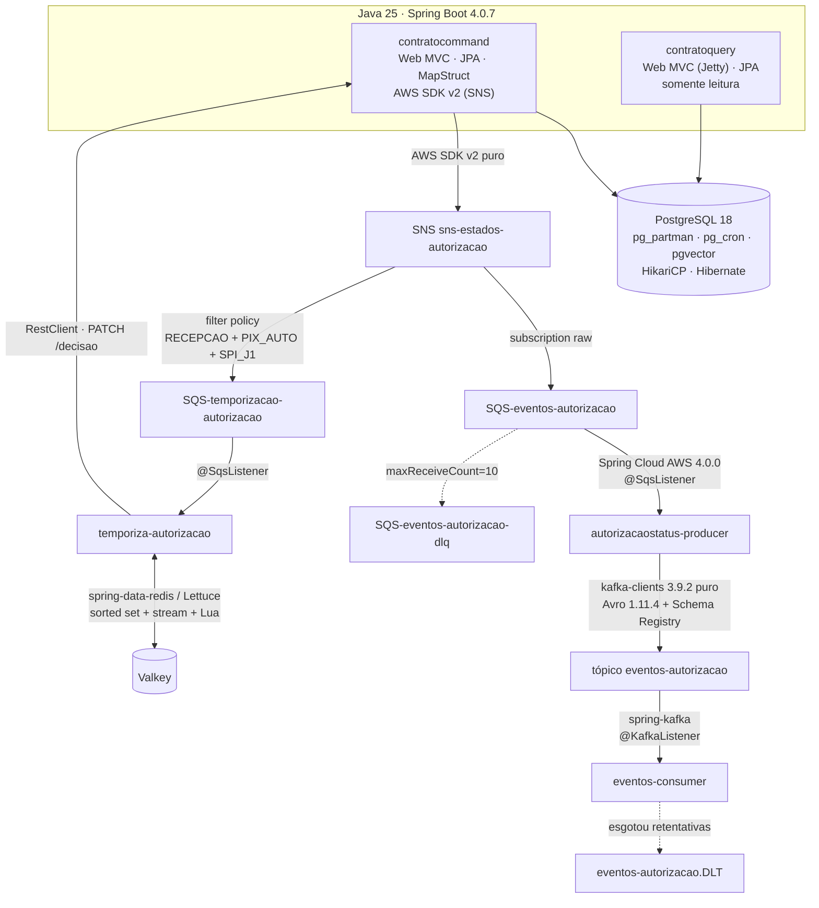
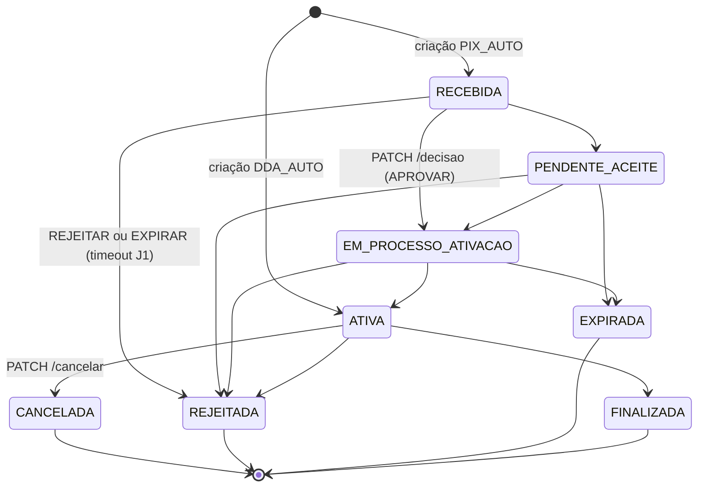

# Stack, System Design e Design Patterns

> Inventário técnico transversal do monorepo: **quais tecnologias** são usadas, **quais
> decisões de arquitetura distribuída** sustentam o sistema e **quais padrões de projeto**
> aparecem no código. Complementa o [contexto_arquitetural.md](contexto_arquitetural.md)
> (visão de negócio e da POC de particionamento) e o [README.md](../../README.md)
> (topologia, portas e como subir o ambiente).
>
> Levantado em 2026-08-14 a partir dos cinco `pom.xml`, dos `CLAUDE.md` de cada app e do
> `infra/`. Seção de arquitetura hexagonal atualizada em 2026-08-17 após a conclusão das
> migrações para o layout `domain`/`application`/`infrastructure` nas cinco apps.

## Onde cada tecnologia atua

## 1. Tecnologias

### Linguagem e build

| Item | Versão | Observação |
|---|---|---|
| Java | 25 | `public static void main()` — a forma `void main()` está pendente de suporte do maven plugin |
| Maven | 3.9+ | Cinco projetos independentes, **sem POM pai agregador** — monorepo por convenção, não por reactor |
| Lombok | 1.18.40 | Uso variável por app (mínimo no consumer/temporizador; declarado e não usado no producer) |
| MapStruct | 1.5.5.Final | Só no `contratocommand`, com `@AfterMapping` |
| JaCoCo | 0.8.15 | Gate de **80% de cobertura de linha** na fase `verify`, nos cinco apps |

### Framework e runtime

- **Spring Boot 4.0.7** em todos os apps: Web MVC, Validation, Actuator.
- **Jetty embutido** no `contratoquery` (Tomcat excluído no `pom.xml`); Tomcat nos demais.
  Undertow não existe mais no Boot 4.0.
- Virtual threads habilitadas — exceto no pipeline do `@SqsListener`, que exige platform
  threads da factory interna do Spring Cloud AWS.
- Profiles: `local` (padrão) e `prod` (exige `SPRING_PROFILES_ACTIVE=prod` explícito).

### Persistência

- **PostgreSQL 18** com `pg_partman`, `pg_cron` e `pgvector` — **sem fallback H2**.
- Spring Data JPA / Hibernate, driver 42.7.12, pool **HikariCP** com
  `connection-init-sql` fixando `plan_cache_mode = force_generic_plan`.
- Serialização JSON: **Jackson 3** (`tools.jackson.databind`) e **Yasson 3.0.3** (JSON-B).
- Apenas `contratocommand` e `contratoquery` tocam o banco; os outros três não
  conhecem o schema.

### Mensageria

| Tecnologia | Onde | Escolha |
|---|---|---|
| SNS | `contratocommand` | **AWS SDK v2 puro** (`software.amazon.awssdk:sns` 2.49.0), sem Spring Cloud AWS |
| SQS | `autorizacaostatus-producer`, `temporiza-autorizacao` | **Spring Cloud AWS 4.0.0** (`@SqsListener`) |
| Kafka (produção) | `autorizacaostatus-producer` | **`kafka-clients` 3.9.2 puro**, produce síncrono |
| Kafka (consumo) | `eventos-consumer` | **spring-kafka** (`@KafkaListener`, `AckMode.RECORD`) |
| Avro + Schema Registry | producer e consumer | Avro 1.11.4 + `kafka-avro-serializer` 7.7.1 (Confluent), classes geradas pelo `avro-maven-plugin` |
| Valkey (Redis) | `temporiza-autorizacao` | `spring-boot-starter-data-redis` / Lettuce — sorted set, stream com consumer group e script Lua |

> A assimetria "cliente puro no SQS/Kafka producer, framework no Kafka consumer" é
> deliberada e está registrada no `design.md` da change `add-eventos-autorizacao-kafka`.

### Infraestrutura

- **Docker Compose** com ponto de entrada único na raiz (`compose.yaml`), incluindo os
  composes de `infra/local/*` e `apps/`; Dockerfiles multi-stage Fargate-ready por app.
- **Terraform** modularizado (`modules/` + `envs/`): `networking`, `ecs-cluster`,
  `ecs-service` e `elasticache-valkey` funcionais; `envs/prod`, `bootstrap`,
  `rds-postgres` e `observability` ainda placeholders.
- **Floci** emula SNS/SQS localmente; Kafka local em KRaft com Schema Registry e Kafbat UI.

## 2. System design

| Padrão | Como aparece aqui |
|---|---|
| **CQRS** (sem event sourcing) | `contratocommand` (escrita) e `contratoquery` (leitura, `DB_READ_ONLY=true`) sobre **a mesma base e a mesma tabela** — separação de responsabilidade e de escala, não de storage |
| **Arquitetura hexagonal clássica** | As cinco apps usam `domain` / `application` / `infrastructure` (ports & adapters): `domain` é Java puro (modelo, portas de entrada/saída), `application` orquestra casos de uso sem conhecer transporte/persistência concretos, `infrastructure` concentra os adapters (web, persistence, messaging, config) |
| **EDA com fan-out e filtro no broker** | SNS publica um evento por transição de estado; duas filas SQS assinam, uma delas com **filter policy** por message attributes (`tipoEvento` + `tipoProduto` + `tipoJornada`) — o consumidor não precisa de lógica de filtro |
| **Publicação pós-commit (outbox ausente por decisão)** | `@TransactionalEventListener(AFTER_COMMIT)`: rollback nunca publica; falha no `publish` só loga e não afeta a resposta HTTP já commitada. Trade-off documentado em `add-eventos-autorizacao-sns-sqs` |
| **Bridge / anti-corruption layer** | `autorizacaostatus-producer` traduz JSON (SQS) → Avro (Kafka); o ack no SQS só ocorre após a confirmação do broker Kafka |
| **Particionamento temporal (Buffer Ring)** | Tabela `autorizacoes` particionada por `id_particao_conta` (faixa 900–999), balde semanal `900 + (semanas desde Epoch % 100)`; expurgo por `DROP PARTITION`, não por `DELETE` |
| **Chave com roteamento embutido** | `ReversibleUUIDv7` grava a partição dentro do próprio UUID — a leitura extrai a partição sem query auxiliar |
| **Delay queue construída sobre Valkey** | Sorted set é o relógio (score = vencimento); um script Lua move os vencidos para um stream, e o `ZREM` dentro do script **é** o lock distribuído (sem Redlock) |
| **Máquina de estados explícita** | `StatusAutorizacao` carrega o grafo de transições; `PIX_AUTO` nasce `RECEBIDA`, `DDA_AUTO` nasce `ATIVA` |
| **Resiliência em cada hop** | DLQ no SQS (`maxReceiveCount=10`), DLT no Kafka (`DefaultErrorHandler` + `DeadLetterPublishingRecoverer`), PEL + `XCLAIM` com teto de 5 tentativas no Valkey, ack manual em todos os pontos |
| **Idempotência** | Índice único parcial por `id_autorizacao_empresa` (só partições quentes), key SHA-256 no Kafka, e `/decisao` exigindo `status == RECEBIDA` explicitamente |
| **Contratos espelhados à mão** | `AutorizacaoEventoPayload` (JSON) e `EventoAutorizacao.avsc` (Avro) são **cópias replicadas manualmente** entre apps — nenhum módulo compartilhado, para não acoplar os deploys |

### Máquina de estados da autorização

> `RECEBIDA → EM_PROCESSO_ATIVACAO → ATIVA` são dois saltos do grafo aplicados numa única
> transação por `DecidirAutorizacaoUseCase`. Os quatro estados terminais disparam a
> transferência da linha para a faixa de expurgo (900–999).

## 3. Design patterns

### Estruturais e de aplicação

- **Ports & Adapters** — `PublicadorEventoAutorizacao` / `KafkaEventoAutorizacaoProducer`,
  `AgendamentoRepository` / `ValkeyAgendamentoRepository`, `DecisaoAutorizacaoClient` /
  `CommandDecisaoAutorizacaoClient`: o use case depende da interface, nunca da classe
  concreta nem de `org.apache.kafka.*`.
- **Command / Use Case (Interactor)** — `CriarAutorizacaoUseCase`,
  `CancelarAutorizacaoUseCase`, `DecidirAutorizacaoUseCase`, todos `@Transactional` e
  chamados diretamente pelo controller (sem orquestrador intermediário).
- **Repository** — `AutorizacaoRepository` com **JPQL explícito**, sem query methods
  derivados, por causa do particionamento.
- **DTO + Mapper (Assembler)** — MapStruct com `@AfterMapping` no command; `from()`
  estático nos DTOs do query (que não usa MapStruct).

### Comportamentais

- **Strategy + Chain of Responsibility** — framework próprio de regras de negócio:
  `Rule<T>` e `Validator<R,T>` em `shared/validationsetup`, com `List<ContratacaoRule>`
  injetada pelo Spring e ordenada por `@Order`. Substituiu as antigas strategies por
  produto: a variação entre `PIX_AUTO` e `DDA_AUTO` vive inteiramente nas rules.
- **Observer** — `ApplicationEventPublisher` + `@TransactionalEventListener` para o
  `AutorizacaoPersistidaEvent`.
- **Interceptor / handler centralizado** — `ApiExceptionHandler`
  (`@RestControllerAdvice`) no lado REST e `SqsEventoAutorizacaoErrorInterceptor` no lado
  mensageria: mesmo papel (ponto único de classificação de falha), domínios diferentes.
- **Template Method / Lifecycle** — `ValkeyStreamConfig` implementa `SmartLifecycle`
  (fase 100) para remover o consumidor do stream **antes** de a conexão Lettuce morrer —
  `@PreDestroy` não funciona nesse ponto.

### Criacionais e de domínio

- **Factory / Value Object** — `ReversibleUUIDv7` (gera e reverte o UUID com partição
  embutida), `IdContaUUIDPartitionDistributor`, `IdAutorizacao` como `@EmbeddedId`.
- **Converter (Adapter de tipo)** — `TipoProdutoConverter` e
  `TipoJornadaAutorizacaoConverter`, ambos `AttributeConverter` do JPA.
- **State** — `StatusAutorizacao.podeTransicionarPara(destino)` concentra o grafo; nenhum
  caller reimplementa as transições.

### Concorrência e tolerância a falha

- **Optimistic locking** — `@Version` na entidade `Autorizacao`; conflito vira **409**,
  incluindo o caso especial de row movement entre partições (SQLSTATE 40001).
- **Fallback em cascata** — `ConsultarAutorizacaoService` procura em três níveis
  **disjuntos** (partição do id → faixa de expurgo → demais partições quentes); acerto no
  nível 3 é, por definição, violação de invariante e gera `WARN`.
- **Retry com teto e descarte consciente** — no SQS, falha não-retryable é engolida (ack)
  e retryable é relançada; no Valkey, `PendenciasSchedulerReivindicador` confirma a
  entrada ao atingir 5 tentativas, registrando `log.error`.

## 4. Convenções transversais

- **422 é o status de entrada inválida do cliente**, tanto para falha de formato
  (`@Valid`) quanto para violação de regra (`BusinessException`) — a distinção é carregada
  pelo *shape* da resposta (`LayoutErrosApiValidationsResponse` vs `LayoutErrosApiResponse`),
  não pelo primeiro byte do status. Decidido em 2026-08-09 (D3 da change
  `reconciliar-contrato-spec-doc`).
- **Nenhum log carrega body de mensagem, record Avro, DTO ou entidade** — o payload tem
  PII (`id_pessoa_pagadora`, `valor`, `descricao`, `metadados`). Identifique por
  `idAutorizacao`, `messageId`, `key`, `streamId`.
- **Nenhuma resposta de erro expõe** nome de classe, stack trace, tabela, coluna ou
  constraint — isso fica no log do servidor.
- **`CLAUDE.md` e `AGENTS.md` de cada app são espelhos idênticos**; mudou um, replique no
  outro.

## Referências

| Assunto | Onde |
|---|---|
| Topologia, portas e como subir o ambiente | [README.md](../../README.md) |
| Visão de negócio e POC de particionamento | [contexto_arquitetural.md](contexto_arquitetural.md) |
| Modelo de dados (Buffer Ring + UUIDv7 reversível) | [modelo-dados-e-dados-poc-testada-para-essa-implementacao.md](modelo-dados-e-dados-poc-testada-para-essa-implementacao.md) |
| Armadilhas e fluxos por serviço | `apps/<serviço>/CLAUDE.md` |
| Contratos vigentes e histórico de decisões | `openspec/specs/` e `openspec/changes/` |
| Estado do Terraform e escopo de infra | [infra/README.md](../../infra/README.md) |
