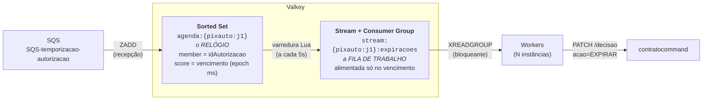
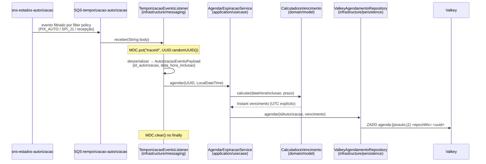
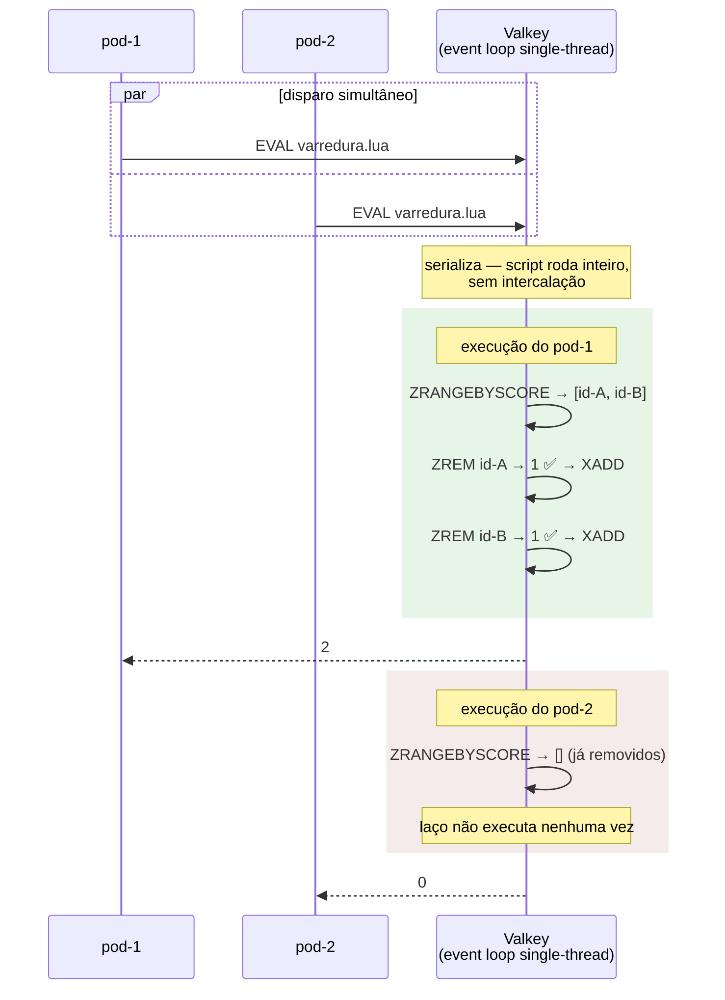
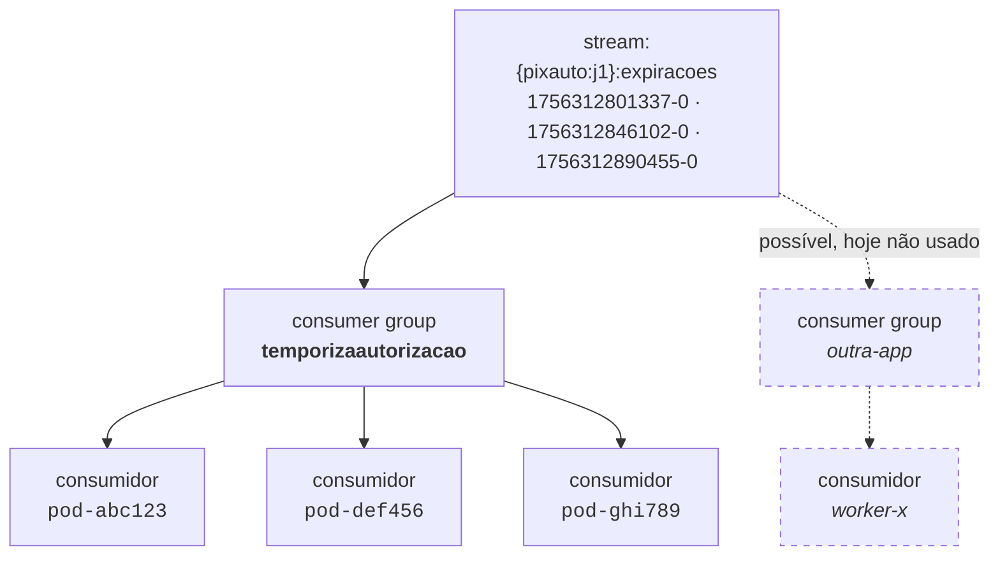
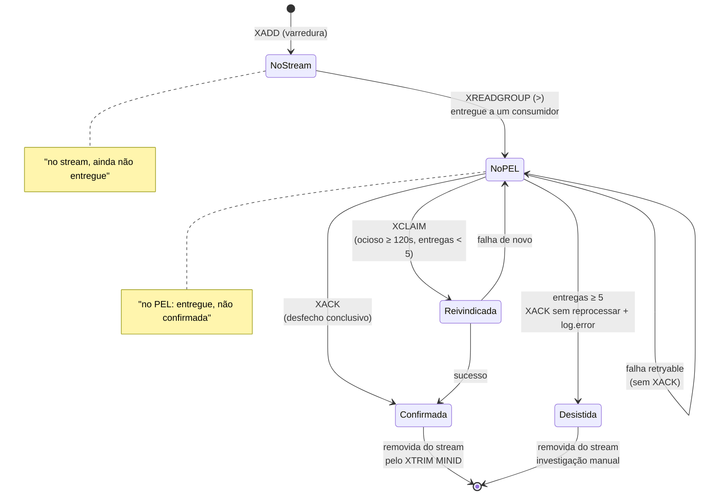
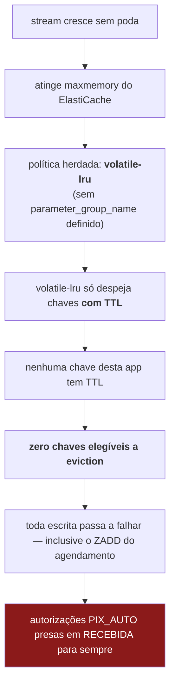
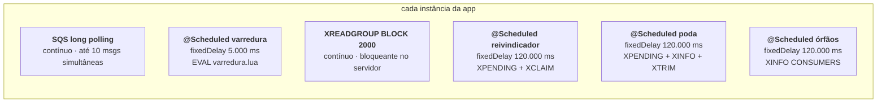
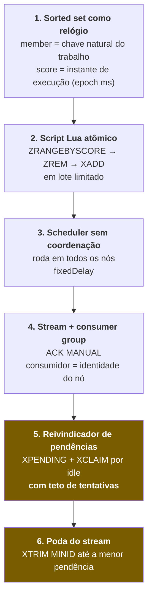

# Mecanismo de temporização com Valkey — agendar, disparar e consumir expirações

> **Escopo**: como a app [`temporiza-autorizacao`](../../apps/temporiza-autorizacao/) escreve no
> Valkey (Redis), como o vencimento vira trabalho, e como uma frota de instâncias consome esse
> trabalho sem duplicar nem perder nada.
>
> **Público**: dev  que precisa entender o mecanismo a fundo — ou replicá-lo em outro
> contexto. Não pressupõe familiaridade prévia com Redis Streams.
>
> **Contrato formal**: [`openspec/specs/agendamento-expiracao-valkey/spec.md`](../../openspec/specs/agendamento-expiracao-valkey/spec.md).
> **Guia da app**: [`apps/temporiza-autorizacao/CLAUDE.md`](../../apps/temporiza-autorizacao/CLAUDE.md).

---

## 1. O problema: "faça isto daqui a 10 minutos, uma vez só, mesmo que eu morra"

Uma autorização `PIX_AUTO` nasce no estado `RECEBIDA` e só vira `ATIVA` quando o cliente pagador
aprova. Se ele não decidir em **10 minutos**, o sistema precisa rejeitá-la sozinho. Isso é um
*delayed job* distribuído, e ele traz quatro exigências que definem todo o desenho:

| Exigência | Consequência no desenho |
|---|---|
| **Atraso** — disparar num instante futuro, não agora | Precisa de uma estrutura ordenada por tempo |
| **Exatamente-uma-vez efetivo** — N pods rodando, 1 expiração | Precisa de eleição de executor |
| **Durabilidade** — pod morre no meio, trabalho não some | Precisa de confirmação explícita e reentrega |
| **Idempotência** — evento duplicado não vira 2 expirações | Precisa de chave natural, não de append cego |

### Por que não as alternativas óbvias

| Alternativa | Por que foi descartada |
|---|---|
| **Só um stream** (`XADD` na recepção) | Entradas de stream **não expiram e não têm entrega com atraso**. O consumidor receberia a entrada imediatamente e teria que dormir 10 min segurando a thread. |
| **Keyspace notifications** (`__keyevent@*__:expired` sobre chaves com TTL) | É pub/sub puro: **sem durabilidade, sem ACK, sem reentrega**. Se nenhum pod estiver conectado no instante do evento, ele se perde para sempre — e ninguém fica sabendo. Além disso o Redis só expira a chave preguiçosamente (no acesso ou na varredura amostral), então o instante do evento não é confiável. |
| **`@Scheduled` varrendo o Postgres** | Acopla o temporizador ao schema particionado de `autorizacoes` (que ele hoje não conhece), e transforma um relógio em carga de banco relacional. |
| **Delay queue do SQS** | Teto de 15 min ajuda, mas o atraso é fixado na publicação e **não é cancelável nem reagendável** — e o cálculo do vencimento aqui parte de `data_hora_inclusao`, não do instante de consumo. |

### A solução: duas estruturas, dois papéis



**O sorted set é o relógio; o stream é a fila de trabalho.** A entrada no stream só nasce no
vencimento. Essa separação é o coração do mecanismo — tudo o mais é consequência dela.

---

## 2. Anatomia das chaves

```
agenda:{pixauto:j1}                    ZSET
├── "3f2a...c1"  →  score 1756312800000   (2026-08-27T18:00:00Z)
├── "8b1e...44"  →  score 1756312845000   (2026-08-27T18:00:45Z)
└── "c7d9...02"  →  score 1756312900000   (2026-08-27T18:01:40Z)
                       ▲
                       └── epoch millis do VENCIMENTO, não da recepção

stream:{pixauto:j1}:expiracoes         STREAM
├── 1756312801337-0  {id_autorizacao: "3f2a...c1"}
└── 1756312846102-0  {id_autorizacao: "8b1e...44"}
       ▲
       └── id gerado pelo Valkey: <millis>-<sequência>. Monotônico. Usado como traceId.

    consumer group: "temporizaautorizacao"
    ├── consumidor "pod-abc123"  → PEL: [1756312801337-0]   (lida, ainda não confirmada)
    └── consumidor "pod-def456"  → PEL: []
```

### As chaves `{}` não são decorativas

`agenda:{pixauto:j1}` e `stream:{pixauto:j1}:expiracoes` compartilham a **hash tag** `{pixauto:j1}`.
Em Redis/Valkey Cluster, o slot de uma chave é calculado por `CRC16` **apenas do que está entre
chaves**. Como as duas chaves têm a mesma hash tag, caem no mesmo slot — e portanto no mesmo nó.

Isso é **obrigatório** aqui: o script Lua toca as duas chaves na mesma execução, e o Cluster recusa
scripts multi-chave que cruzam slots (`CROSSSLOT Keys in request don't hash to the same slot`).
Remover as chaves `{}` faz a app funcionar em standalone e quebrar em produção no ElastiCache.

> Definidas em [`application.yaml`](../../apps/temporiza-autorizacao/src/main/resources/application.yaml).

---

## 3. Fase 1 — a escrita no Valkey (agendamento)

### Fluxo



### O código que importa

**[`TemporizacaoEventoListener.receber()`](../../apps/temporiza-autorizacao/src/main/java/br/com/srportto/temporizaautorizacao/infrastructure/messaging/TemporizacaoEventoListener.java)**
— adaptador de entrada. Só traduz o formato de fio em tipos simples e delega. **Não tem
`try/catch` de negócio**: a classificação ack-vs-retenção é responsabilidade única do
`TemporizacaoEventoErrorInterceptor`.

```java
@SqsListener(queueNames = "${sqs.queue-url}", factory = "temporizacaoSqsListenerContainerFactory")
public void receber(String body) {
    MDC.put("traceId", UUID.randomUUID().toString());
    try {
        AutorizacaoEventoPayload payload = desserializar(body);
        useCase.agendar(payload.idAutorizacao(), payload.dataHoraInclusao());
    } finally {
        MDC.clear();   // thread vem de pool e é reaproveitada entre mensagens
    }
}
```

**[`CalculadoraVencimento.calcular()`](../../apps/temporiza-autorizacao/src/main/java/br/com/srportto/temporizaautorizacao/domain/model/CalculadoraVencimento.java)**
— a única regra de negócio da app, e ela cabe em uma linha:

```java
public static Instant calcular(LocalDateTime dataHoraInclusao, Duration prazo) {
    return dataHoraInclusao.plus(prazo).toInstant(ZoneOffset.UTC);
}
```

Dois detalhes que parecem triviais e não são:

- **A base é `data_hora_inclusao` do payload, não `Instant.now()`.** Se a mensagem for reentregue
  pelo SQS 3 minutos depois (visibility timeout, falha de rede, redeploy), o vencimento **não
  desliza**. Usar `now()` faria cada reentrega adiar a expiração — um bug que só aparece em
  produção sob falha.
- **`ZoneOffset.UTC` é explícito.** O cálculo não pode depender do fuso da JVM: réplicas podem
  rodar em hosts com `TZ` diferente, e o mesmo evento produziria vencimentos distintos.

**[`ValkeyAgendamentoRepository.agendar()`](../../apps/temporiza-autorizacao/src/main/java/br/com/srportto/temporizaautorizacao/infrastructure/persistence/ValkeyAgendamentoRepository.java)**
— o adaptador. Uma linha de Redis:

```java
redisTemplate.opsForZSet().add(
        properties.chaveAgenda(),
        idAutorizacao.toString(),   // member
        vencimento.toEpochMilli());  // score
```

### Idempotência é de graça

`ZADD` com um *member* que já existe **sobrescreve o score**, não cria uma segunda entrada. Como o
member é o `idAutorizacao`, consumir o mesmo evento duas vezes deixa exatamente um agendamento.

Isso não é um detalhe de implementação: é a razão de o id da autorização ser o member em vez de,
digamos, um UUID de agendamento. **A idempotência está na escolha da chave natural**, não em código
de deduplicação.

### Classificação de falha na entrada

**[`TemporizacaoEventoErrorInterceptor`](../../apps/temporiza-autorizacao/src/main/java/br/com/srportto/temporizaautorizacao/infrastructure/messaging/TemporizacaoEventoErrorInterceptor.java)**
é o ponto único de decisão:

| Situação | Ação | Efeito no SQS |
|---|---|---|
| `AgendamentoInvalidoException` (JSON inválido, campo faltando) | engole a exceção | mensagem **confirmada** — retry nunca resolveria payload malformado |
| Qualquer outra falha (Valkey fora, timeout) | **relança** | sem ACK → volta à fila após o visibility timeout |

O container roda com `AcknowledgementMode.ON_SUCCESS` e `maxConcurrentMessages(10)`
([`SqsListenerContainerFactoryConfig`](../../apps/temporiza-autorizacao/src/main/java/br/com/srportto/temporizaautorizacao/infrastructure/config/SqsListenerContainerFactoryConfig.java)).

---

## 4. Fase 2 — a varredura e o script Lua

Este é o ponto onde a maioria das pessoas se confunde, então vale começar pela conclusão:

> ### ⚠️ Há **duas** eleições distintas, em camadas diferentes
>
> | | Quem elege | O que é eleito | Mecanismo |
> |---|---|---|---|
> | **Eleição 1** | O script Lua (`ZREM` + atomicidade do `EVAL`) | Qual pod **PUBLICA** a entrada no stream | Lógica da aplicação |
> | **Eleição 2** | O consumer group do Valkey (`XREADGROUP`) | Qual pod **LÊ/PROCESSA** a entrada | Nativo do Redis Streams |
>
> **O script Lua não escolhe quem lê a expiração.** Ele escolhe quem a *cria*. Quem distribui a
> leitura é o consumer group — e ele faria isso mesmo que o Lua não existisse.

### O script, comentado

[`varredura.lua`](../../apps/temporiza-autorizacao/src/main/resources/scripts/varredura.lua):

```lua
-- KEYS[1] = chave da agenda (sorted set)
-- KEYS[2] = chave do stream de expiracoes
-- ARGV[1] = instante atual (epoch millis)
-- ARGV[2] = tamanho maximo do lote

local vencidos = redis.call('ZRANGEBYSCORE', KEYS[1], '-inf', ARGV[1], 'LIMIT', 0, tonumber(ARGV[2]))
local criados = 0

for _, idAutorizacao in ipairs(vencidos) do
    local removido = redis.call('ZREM', KEYS[1], idAutorizacao)
    if removido == 1 then
        redis.call('XADD', KEYS[2], '*', 'id_autorizacao', idAutorizacao)
        criados = criados + 1
    end
end

return criados
```

Linha a linha:

1. **`ZRANGEBYSCORE ... '-inf' <agora> LIMIT 0 <lote>`** — pega até `<lote>` ids cujo vencimento já
   passou, em ordem cronológica (o mais atrasado primeiro). `-inf` como piso significa "tudo que
   venceu, por mais antigo que seja" — garante que um backlog acumulado durante um downtime seja
   drenado, não pulado.
2. **`ZREM`** — remove o id da agenda. O retorno é `1` se este script removeu, `0` se já não
   estava lá.
3. **`XADD ... '*'`** — só executa se `ZREM` retornou `1`. O `*` deixa o Valkey gerar o id da
   entrada (`<millis>-<seq>`, monotônico).
4. **`return criados`** — quantas entradas de trabalho este pod criou. Vira log em
   `VarrerAgendamentosVencidosService`.

### Por que isso é seguro sem lock distribuído

**A garantia real vem da atomicidade do `EVAL`, não do `ZREM`.** Redis e Valkey executam scripts
Lua no mesmo event loop single-thread que atende os comandos normais: enquanto o script roda,
**nenhum outro cliente é atendido**. Não existe intercalação. Isso significa que, se seis pods
disparam a varredura no mesmo milissegundo, o servidor os **serializa**:



Na prática, **`ZREM` quase nunca retorna `0`** — o `ZRANGEBYSCORE` do pod perdedor já vem vazio,
porque o vencedor rodou por inteiro antes. Então por que o `if removido == 1` existe?

- É **cinto e suspensório correto por construção**: a lógica permanece válida se o script um dia
  ganhar `redis.setresp`, paginação por cursor, ou for quebrado em partes não atômicas.
- Documenta a **intenção** ("a remoção concede o direito de criar o trabalho"), que é o invariante
  que o [spec](../../openspec/specs/agendamento-expiracao-valkey/spec.md) exige.
- Custa um retorno de inteiro. É barato demais para valer a economia.

> **Não adicione Redlock/lock distribuído por cima disso.** Seria um lock protegendo uma operação
> que já é atômica por definição — só adiciona round-trips, pontos de falha e risco de deadlock.
> Está listado como armadilha crítica nº 5 no `CLAUDE.md` da app.

### O disparo

[`VarreduraAgendamentoScheduler`](../../apps/temporiza-autorizacao/src/main/java/br/com/srportto/temporizaautorizacao/infrastructure/scheduler/VarreduraAgendamentoScheduler.java)
— roda em **todas** as instâncias, sem coordenação:

```java
@Scheduled(fixedDelayString = "${temporizacao.varredura-intervalo-ms}")  // 5000 ms
public void executar() {
    useCase.varrer();
}
```

O script é carregado uma vez como `static final` e enviado via `EVALSHA` pelo Spring Data Redis
(com fallback automático para `EVAL` se o cache de scripts do servidor tiver sido limpo):

```java
private static final RedisScript<Long> SCRIPT_VARREDURA = criarScriptVarredura();
```

### A latência que isso introduz

O vencimento é instantâneo, mas o disparo é amostrado a cada 5 s:

```
vencimento em T ────┬──────────────────────────────► tempo
                    │
    varredura   ────●─────────●─────────●─────────●
                  T-4s       T+1s      T+6s
                              ▲
                              └── entrada criada aqui

latência de detecção:  0 a 5 s   (média 2,5 s)
```

Para uma regra de negócio de 10 minutos, 2,5 s de imprecisão é irrelevante. Se o seu caso exigir
precisão sub-segundo, o parâmetro a mexer é `varredura-intervalo-ms` — e a seção 9 mostra o custo.

---

## 5. Fase 3 — o consumo (e como várias instâncias dividem o trabalho)

### O modelo do consumer group

Esta é a parte que responde "como mais de uma aplicação consome o evento de expiração". Redis
Streams tem dois eixos independentes:



| Eixo | Comportamento | Analogia |
|---|---|---|
| **Entre grupos** | **Fan-out** — cada grupo recebe **todas** as entradas, com cursor próprio | Tópico SNS |
| **Dentro de um grupo** | **Load balancing** — cada entrada vai para **exatamente um** consumidor | Fila SQS |

**Hoje existe um único grupo** (`temporizaautorizacao`), e as N instâncias da app são consumidores
dentro dele. Ou seja: cada expiração é processada **uma vez só**, por um pod qualquer. Se amanhã
outra aplicação precisar reagir às mesmas expirações (auditoria, notificação, métricas), basta
criar **outro consumer group** sobre o mesmo stream — ela receberia uma cópia de tudo, sem tirar
nada do grupo existente e sem qualquer mudança nesta app.

### A identidade do consumidor

```yaml
consumidor-id: ${HOSTNAME:worker-local}
```

Em Kubernetes, `HOSTNAME` é o nome do pod — único e estável durante a vida do pod. É essa string
que o Valkey usa para atribuir o PEL (*Pending Entries List*).

> ⚠️ **Rodando fora do Docker**, `HOSTNAME` não existe e o default `worker-local` entra em ação.
> Duas execuções locais simultâneas compartilhariam o mesmo nome de consumidor e disputariam o
> mesmo PEL — comportamento confuso e difícil de diagnosticar.

### O registro da subscription

[`ValkeyStreamConfig`](../../apps/temporiza-autorizacao/src/main/java/br/com/srportto/temporizaautorizacao/infrastructure/config/ValkeyStreamConfig.java)

```java
@Bean
public StreamMessageListenerContainer<...> streamMessageListenerContainer(RedisConnectionFactory cf) {
    var options = StreamMessageListenerContainer.StreamMessageListenerContainerOptions
            .builder()
            .pollTimeout(Duration.ofSeconds(2))   // XREADGROUP BLOCK 2000
            .build();
    var container = StreamMessageListenerContainer.create(cf, options);
    container.start();
    return container;
}

@Bean
public Subscription expiracaoStreamSubscription(...) {
    criarGrupoSeNaoExistir(redisTemplate, properties);           // XGROUP CREATE ... MKSTREAM
    var consumer = Consumer.from(properties.grupoConsumidor(), properties.consumidorId());
    var offset = StreamOffset.create(properties.chaveStream(), ReadOffset.lastConsumed());  // ">"
    return container.receive(consumer, offset, listener);        // ← ACK MANUAL
}
```

Três decisões embutidas aqui:

1. **`container.receive(...)`** (e não `receiveAutoAck`) — **ACK manual**. Esta é a decisão mais
   importante do consumo inteiro: sem ela, o Valkey confirmaria a entrada na hora da leitura e um
   pod que morresse durante o `PATCH` perderia a expiração silenciosamente.
2. **`ReadOffset.lastConsumed()`** — o `>` do `XREADGROUP`: "só entradas nunca entregues a este
   grupo". Entradas já entregues e não confirmadas ficam no PEL, recuperadas pelo reivindicador
   (seção 6), não por esta leitura.
3. **`MKSTREAM`** na criação do grupo — o stream pode nem existir ainda (nenhuma expiração
   disparou desde o deploy). `BUSYGROUP` na resposta é tratado como sucesso, tornando a criação
   idempotente entre as N instâncias que sobem ao mesmo tempo.

### O polling do stream não é busy-wait

`pollTimeout(2s)` vira `XREADGROUP ... BLOCK 2000`. A conexão fica **bloqueada no servidor** até
uma das duas coisas acontecer:

- chega entrada nova → retorna **imediatamente** (latência de entrega ~0);
- passam 2 s sem nada → retorna vazio, e o container repete.

Não há espera ativa nem custo de CPU. Em regime ocioso, o custo é 1 comando a cada 2 s por
instância — e o comando fica parado, não girando.

### O worker

[`ExpiracaoStreamListener`](../../apps/temporiza-autorizacao/src/main/java/br/com/srportto/temporizaautorizacao/infrastructure/messaging/ExpiracaoStreamListener.java)

```java
@Override
public void onMessage(MapRecord<String, String, String> message) {
    processarEConfirmarSeConcluido(message.getId(), message.getValue().get(CAMPO_ID_AUTORIZACAO));
}

public void processarEConfirmarSeConcluido(RecordId streamId, String idAutorizacaoStr) {
    MDC.put("traceId", streamId.getValue());   // o próprio streamId é o correlation id
    try {
        UUID idAutorizacao = UUID.fromString(idAutorizacaoStr);
        processarExpiracaoUseCase.processar(idAutorizacao);
        confirmar(streamId);                    // ← XACK só chega aqui
    } catch (ExpiracaoRetryavelException e) {
        log.error("Falha retryable ..., entrada permanece pendente: streamId={}", streamId, e);
    } catch (RuntimeException e) {
        log.error("Falha inesperada ..., entrada permanece pendente: streamId={}", streamId, e);
    } finally {
        MDC.clear();
    }
}
```

Note que **o método é `public` de propósito**: o `PendenciasSchedulerReivindicador` chama
exatamente este mesmo método para reprocessar entradas reivindicadas. Um único caminho de
ack/retry, sem lógica duplicada.

O `catch (RuntimeException)` genérico é deliberado: um UUID malformado no stream lançaria
`IllegalArgumentException` e, sem esse catch, escaparia do listener **sem log e sem decisão de
ack** — a entrada ficaria pendente por acidente em vez de por escolha.

### O contrato de status HTTP decide o ACK

[`CommandDecisaoAutorizacaoClient`](../../apps/temporiza-autorizacao/src/main/java/br/com/srportto/temporizaautorizacao/infrastructure/external/CommandDecisaoAutorizacaoClient.java)
traduz respostas HTTP em "conclusivo" vs. "retryable":

```java
try {
    restClient.patch()
            .uri("/api/autorizacoes/{id}/decisao", idAutorizacao)
            .header("tipoProduto", "PIX_AUTO")
            .body(Map.of("acao", "EXPIRAR"))
            .retrieve()
            .toBodilessEntity();
} catch (HttpClientErrorException.Conflict e) {          // ← ORDEM IMPORTA
    throw new ExpiracaoRetryavelException(...);
} catch (HttpClientErrorException e) {                   // demais 4xx
    log.info("Command respondeu {} ... nada a fazer", e.getStatusCode(), idAutorizacao);
} catch (HttpServerErrorException | ResourceAccessException e) {
    throw new ExpiracaoRetryavelException(...);
}
```

| Resposta | Significado | Ação |
|---|---|---|
| **2xx** | expiração aplicada | `XACK` |
| **409** | conflito de lock otimista — **transação revertida** | **sem `XACK`**, permanece no PEL |
| **4xx exceto 409** (inclui **422** "já resolvida"/não encontrada) | nada a fazer | `XACK` |
| **5xx / timeout / erro de conexão** | não se sabe o desfecho | **sem `XACK`** |

> 🔥 **`409` é a armadilha desta app.** É tentador tratá-lo como "mais um 4xx" — afinal, é família
> 4xx. Mas 422 significa *"rodei a transação e confirmei que não há nada a fazer"*, enquanto 409
> significa *"a transação foi revertida"*: a expiração **pode não ter sido aplicada**. Confirmar
> (`XACK`) um 409 prende a autorização em `RECEBIDA` **para sempre**, sem retry possível e sem
> sinal nenhum. Por isso o `catch` de `HttpClientErrorException.Conflict` vem **antes** do catch
> genérico — inverter essas duas linhas reintroduz o bug (corrigido pela change
> `corrigir-ack-indevido-expiracao-409`).

---

## 6. Fase 4 — recuperação de falhas (PEL, XCLAIM e teto de tentativas)

### O que é o PEL

Quando um consumidor lê uma entrada via `XREADGROUP`, o Valkey a registra na **Pending Entries
List** daquele consumidor, com: o id da entrada, o consumidor dono, o instante da última entrega
e um **contador de entregas**. A entrada só sai do PEL com `XACK`.

Isso significa que "pod morreu entre ler e confirmar" não é um caso especial — é o caso normal, e
o Valkey já guardou a evidência.



### O reivindicador

[`PendenciasSchedulerReivindicador`](../../apps/temporiza-autorizacao/src/main/java/br/com/srportto/temporizaautorizacao/infrastructure/scheduler/PendenciasSchedulerReivindicador.java),
rodando a cada `stream-min-idle-time-ms` (120 s) em **todas** as instâncias:

```java
@Scheduled(fixedDelayString = "${temporizacao.stream-min-idle-time-ms}")
public void reivindicarPendenciasOciosas() {
    // 1. XPENDING — até 100 pendências do grupo (qualquer consumidor)
    pendentes = streamOps.pending(chaveStream, grupoConsumidor, Range.unbounded(), 100);

    // 2. filtra por tempo desde a última entrega >= 120s
    List<PendingMessage> ociosas = pendentes.stream()
            .filter(msg -> msg.getElapsedTimeSinceLastDelivery().compareTo(minIdle) >= 0)
            .toList();

    // 3. separa esgotadas (>= 5 entregas) de reprocessáveis
    List<PendingMessage> esgotadas = ociosas.stream()
            .filter(msg -> msg.getTotalDeliveryCount() >= MAX_TENTATIVAS_EXPIRACAO).toList();
    List<String> idsReprocessaveis = ociosas.stream()
            .filter(msg -> msg.getTotalDeliveryCount() < MAX_TENTATIVAS_EXPIRACAO)
            .map(PendingMessage::getIdAsString).toList();

    if (!esgotadas.isEmpty()) desistirDeEntradasEsgotadas(streamOps, minIdle, esgotadas);

    // 4. XCLAIM: transfere a posse para ESTE consumidor (incrementa delivery count)
    var reivindicadas = streamOps.claim(chaveStream, grupoConsumidor, consumidorId,
            XClaimOptions.minIdle(minIdle).ids(idsReprocessaveis));

    // 5. reprocessa pelo MESMO caminho do listener normal
    for (var record : reivindicadas) {
        listener.processarEConfirmarSeConcluido(record.getId(), ...);
    }
}
```

**Por que `min-idle-time` funciona como detector de morte.** Uma instância viva mantém o `idle` do
seu consumidor perto de zero — o container faz `XREADGROUP` continuamente, mesmo sem dado novo. Só
o consumidor de uma instância morta (ou travada) ultrapassa 120 s de ociosidade. Não é preciso
heartbeat, lease nem service discovery: **o próprio polling é o sinal de vida**.

**Por que o `XCLAIM` é seguro entre N reivindicadores.** `XCLAIM` com `MINIDLE` é atômico e
condicional: ele só transfere a posse se a entrada realmente estiver ociosa há pelo menos aquele
tempo — e o próprio ato de reivindicar **zera o idle**. Se seis pods tentam reivindicar a mesma
entrada, o primeiro leva; os outros recebem lista vazia. Terceira eleição do sistema, também
gratuita.

### O teto de 5 tentativas

Sem teto, uma entrada que falhasse de forma persistente recircularia entre o PEL e o reivindicador
**para sempre**, a cada 120 s, sem nenhum sinal operacional — um loop silencioso e eterno.

```java
private void desistirDeEntradasEsgotadas(...) {
    var reivindicadas = streamOps.claim(..., XClaimOptions.minIdle(minIdle).ids(ids));
    for (var record : reivindicadas) {
        log.error("Entrada {} (autorização {}) esgotou o teto de {} tentativas — confirmando sem "
                + "novo acionamento do command; requer investigação manual", ...);
        streamOps.acknowledge(chaveStream, grupoConsumidor, record.getId());
    }
}
```

`getTotalDeliveryCount()` é o contador **nativo** do `XPENDING`, incrementado pelo próprio Valkey a
cada `XCLAIM`. Não há estado de tentativas mantido pela aplicação.

> **Não existe DLQ.** Não há stream de "mortas". A entrada esgotada é confirmada e o rastro é o
> `log.error` com `streamId` e `idAutorizacao` — nunca o corpo do evento. A investigação é manual.
> É uma decisão consciente de escopo, não um esquecimento.

---

## 7. Fase 5 — a higiene que ninguém lembra até quebrar

Duas tarefas periódicas existem por motivos que só aparecem semanas depois do deploy.

### 7.1 Poda do stream — `ExpiracaoStreamTrimScheduler`

> **`XACK` remove do PEL, nunca do stream.** A entrada confirmada continua ocupando memória
> indefinidamente.

E aqui a cadeia de consequências é brutal:



A poda ([`ExpiracaoStreamTrimScheduler`](../../apps/temporiza-autorizacao/src/main/java/br/com/srportto/temporizaautorizacao/infrastructure/scheduler/ExpiracaoStreamTrimScheduler.java))
usa `XTRIM MINID`, nunca `MAXLEN` — o limite é sempre **o menor id ainda pendente**, então uma
entrada não processada jamais é removida:

```java
private String calcularLimiteDePoda() {
    PendingMessagesSummary pendentes = redisTemplate.opsForStream().pending(chaveStream, grupo);
    if (pendentes != null && pendentes.getTotalPendingMessages() > 0) {
        return pendentes.minMessageId();        // trava na pendência mais antiga
    }
    return ultimoIdEntregue();                  // PEL vazio → tudo antes já foi processado
}
```

Com o PEL vazio, o limite é o **sucessor** do `lastDeliveredId`, não ele mesmo — `MINID` é
inclusivo, e usar o próprio id deixaria essa última entrada para trás para sempre:

```java
/** Id de stream é "<millis>-<sequencia>" — o sucessor incrementa a sequência em 1. */
private String sucessorDoId(String id) {
    int separador = id.lastIndexOf('-');
    return id.substring(0, separador) + "-" + (Long.parseLong(id.substring(separador + 1)) + 1);
}
```

Detalhe de implementação: **Spring Data Redis não expõe `XTRIM MINID`** (só `MAXLEN`), então o
comando é emitido em baixo nível via `RedisCallback` + `connection.execute("XTRIM", ...)`.

### 7.2 Consumidores órfãos — duas camadas

Cada pod que sobe registra um consumidor no grupo. Sem remoção, após meses de redeploys o grupo
acumula centenas de consumidores mortos, degradando `XINFO CONSUMERS` e `XPENDING`.

| Camada | Componente | Gatilho | Cobre |
|---|---|---|---|
| **1** | `ValkeyStreamConfig.stop()` (`SmartLifecycle`, fase **100**) | shutdown gracioso | `SIGTERM`, rolling update |
| **2** | `ConsumidoresOrfaosLimpezaScheduler` (a cada 120 s) | idle ≥ `consumidor-ocioso-limite-ms` (600 s) | `SIGKILL`, OOM, nó perdido |

> ⚠️ **Por que `SmartLifecycle` e não `@PreDestroy`.** `@PreDestroy` foi a primeira tentativa e
> falhava **sempre** em runtime com `IllegalStateException`: o Spring executa a fase
> `Lifecycle.stop()` de todo bean `SmartLifecycle` — **incluindo o `LettuceConnectionFactory`, que
> está na fase padrão 0** — antes da fase de `@PreDestroy`/`DisposableBean`. A conexão Redis já
> estava morta quando o `@PreDestroy` tentava usá-la. A fase 100 garante parar **antes** da
> conexão, com ela ainda viva.

> 🔥 **Nunca remova um consumidor com PEL não vazio.** `XGROUP DELCONSUMER` **descarta** as
> pendências do consumidor removido: elas não voltam ao grupo, não são reivindicáveis por `XCLAIM`
> e nunca mais são entregues. A autorização fica presa em `RECEBIDA` para sempre, sem sinal nenhum.

As duas camadas passam por
[`ConsumidorStreamRemovedor.removerSeSemPendencia()`](../../apps/temporiza-autorizacao/src/main/java/br/com/srportto/temporizaautorizacao/infrastructure/messaging/ConsumidorStreamRemovedor.java),
que checa `pendingCount` **imediatamente antes** de remover (nunca reaproveitando leitura de ciclo
anterior) e ainda audita o resultado:

```java
Long descartadas = removerConsumidor(consumidorId);
if (descartadas != null && descartadas > 0) {
    log.error("Remoção do consumidor '{}' ... descartou {} entrada(s) pendente(s) — "
            + "a verificação prévia de pending foi violada", consumidorId, descartadas);
}
```

Para obter esse número, é preciso **descer ao driver nativo do Lettuce**
(`RedisClusterAsyncCommands#xgroupDelconsumer`, tipado `Long`): a API tipada do Spring Data Redis
devolve só `Boolean`, e o `execute` genérico decodifica a resposta como *bulk string* e lança
`UnsupportedOperationException` em runtime sobre o inteiro real que o comando retorna.

---

## 8. Todos os pollings, num só lugar



| # | Componente | Intervalo | Propriedade | Comandos por ciclo | Roda em |
|---|---|---|---|---|---|
| 1 | `TemporizacaoEventoListener` | long polling contínuo | — | `ReceiveMessage` (SQS) | todas |
| 2 | `VarreduraAgendamentoScheduler` | **5 s** | `varredura-intervalo-ms` | 1 `EVALSHA` (≤ 1 + 2×lote internos) | todas |
| 3 | `StreamMessageListenerContainer` | **2 s** (block) | `pollTimeout` (hardcoded) | 1 `XREADGROUP` | todas |
| 4 | `PendenciasSchedulerReivindicador` | **120 s** | `stream-min-idle-time-ms` | 1 `XPENDING` + 0–2 `XCLAIM` | todas |
| 5 | `ExpiracaoStreamTrimScheduler` | **120 s** | `stream-min-idle-time-ms` | 1 `XPENDING` + 0–1 `XINFO GROUPS` + 1 `XTRIM` | todas |
| 6 | `ConsumidoresOrfaosLimpezaScheduler` | **120 s** | `stream-min-idle-time-ms` | 1 `XINFO CONSUMERS` + 0–n `XGROUP DELCONSUMER` | todas |

**Nenhum deles tem coordenação entre instâncias.** Todos rodam em todos os pods, e a correção vem
da atomicidade das operações do Valkey — não de eleição de líder.

> **`fixedDelay`, não `fixedRate`.** O intervalo conta do **fim** da execução anterior, então uma
> varredura lenta não enfileira execuções sobrepostas. Com `fixedRate` e um Valkey degradado, as
> execuções se acumulariam e piorariam a degradação.

**Por que `consumidor-ocioso-limite-ms` (600 s) é 5× o `stream-min-idle-time-ms` (120 s):** uma
instância viva mantém idle perto de zero por causa do polling nº 3. O múltiplo generoso garante
que só consumidor de instância genuinamente morta ultrapasse o limiar — nunca um pod vivo em
momento de baixa.

---

## 9. Stress: qual é o custo real disso

> As contas abaixo são **analíticas**, derivadas da configuração — não são benchmark medido. Use-as
> para dimensionar e para saber **o que medir**, não como números de produção.

### 9.1 Carga no Valkey em regime ocioso

Com **N instâncias** e nenhuma expiração acontecendo:

| Origem | Fórmula | N=3 | N=6 | N=20 |
|---|---|---|---|---|
| `XREADGROUP` (block 2 s) | N ÷ 2 | 1,5 ops/s | 3,0 ops/s | 10 ops/s |
| `EVALSHA` varredura (5 s) | N ÷ 5 | 0,6 ops/s | 1,2 ops/s | 4 ops/s |
| 3 schedulers de 120 s | 3N ÷ 120 | 0,075 ops/s | 0,15 ops/s | 0,5 ops/s |
| **Total ocioso** | | **≈ 2,2 ops/s** | **≈ 4,4 ops/s** | **≈ 14,5 ops/s** |

Um Valkey modesto entrega **100.000+ ops/s**. O piso ocioso é **~0,004%** da capacidade com 6 pods.
Em termos de carga bruta, este mecanismo é ruído.

### 9.2 O custo que realmente importa: o bloqueio do event loop

Redis/Valkey é **single-threaded** para execução de comandos. Um script Lua roda **inteiro, sem
intercalação** — durante esse tempo, **todos os outros clientes esperam**, inclusive os de outras
aplicações que compartilhem a instância.

```
EVAL varredura.lua com lote = L, e K ids efetivamente vencidos:

  1 × ZRANGEBYSCORE   O(log(N) + L)
  K × ZREM            O(log(N))  cada
  K × XADD            O(1)       cada
  ─────────────────────────────────────
  total: 1 + 2K comandos dentro de UM bloqueio
```

| `varredura-lote` | Comandos por bloqueio (pior caso) | Stall estimado | Veredito |
|---|---|---|---|
| **100** (atual) | 201 | ~0,2–1 ms | ✅ seguro |
| 1.000 | 2.001 | ~2–10 ms | ⚠️ perceptível |
| 10.000 | 20.001 | ~20–100 ms | ❌ **p99 de todos os clientes vai ao chão** |

> **Esse é o parâmetro perigoso do sistema.** `varredura-lote: 100` parece conservador e é
> deliberado. Aumentá-lo para "drenar backlog mais rápido" troca vazão de expiração por latência
> de **todo mundo** que fala com aquele Valkey. Se precisar de mais vazão, aumente a **frequência**
> (`varredura-intervalo-ms` menor) ou o número de pods — não o lote.

### 9.3 Amplificação: trabalho desperdiçado por instância

A varredura roda em todos os pods, mas só um faz trabalho útil por ciclo:

```
N pods × 1 EVAL a cada 5s = N execuções
                          ↓
        1 execução move os vencidos (a primeira a chegar)
        N-1 execuções fazem ZRANGEBYSCORE e recebem lista VAZIA
```

O desperdício é **O(log N) por pod perdedor** — o `ZRANGEBYSCORE` sobre um conjunto sem elementos
elegíveis termina imediatamente. Ele **não** varre o lote inteiro à toa. Por isso a abordagem
escala bem: o custo do "perdedor" é próximo de zero, e não há round-trip de lock.

### 9.4 Memória

O prazo de 10 minutos define o tamanho de regime do sorted set — ele **não cresce
indefinidamente**, porque cada agendamento sai dele no vencimento:

```
tamanho estável do ZSET  ≈  taxa de recepção (autorizações/s) × prazo (s)
```

| Taxa de recepção | Entradas no ZSET | Memória estimada (~100 B/entrada) |
|---|---|---|
| 10 aut/s | 6.000 | ~0,6 MB |
| 100 aut/s | 60.000 | ~6 MB |
| 1.000 aut/s | 600.000 | ~60 MB |

O stream acumula entre podas (120 s): `taxa × 120` entradas, todas removidas no ciclo seguinte —
desde que o PEL não trave a poda. **Uma única entrada presa no PEL congela o `MINID` e o stream
volta a crescer sem limite.** É o modo de falha mais insidioso do sistema, e a razão de o teto de
5 tentativas (seção 6) existir.

### 9.5 Vazão de expiração — o gargalo não é o Valkey

Aqui está o número que costuma surpreender:

> **O `StreamMessageListenerContainer` entrega as mensagens ao listener de forma serial dentro da
> subscription.** Uma subscription = uma thread de polling, e os records do lote são processados
> um a um, sincronamente.

E o processamento é um `PATCH` HTTP **síncrono** ao `contratocommand`, com timeout de 5.000 ms:

```
vazão por instância  =  1 ÷ latência do PATCH
vazão total          =  N ÷ latência do PATCH
```

| Latência do `PATCH` | 1 pod | 6 pods | 20 pods |
|---|---|---|---|
| 20 ms | 50 exp/s | 300 exp/s | 1.000 exp/s |
| 100 ms | 10 exp/s | 60 exp/s | 200 exp/s |
| 500 ms | 2 exp/s | 12 exp/s | 40 exp/s |
| 5.000 ms (timeout) | 0,2 exp/s | 1,2 exp/s | 4 exp/s |

**A capacidade de expiração é governada pelo `contratocommand`, não pelo Valkey.** Se a vazão não
for suficiente, as alavancas em ordem de eficácia são:

1. **reduzir a latência do `PATCH`** (a alavanca com maior retorno);
2. **aumentar N** (escala linearmente, e é a alavanca operacional mais simples);
3. registrar múltiplas subscriptions por instância (mudança de código, não de config).

O teto do Valkey — `varredura-lote × N ÷ intervalo` = 100 × 6 ÷ 5 = **120 expirações/s** com 6 pods
— só se torna o gargalo se o `PATCH` for muito rápido (< ~50 ms) e N for pequeno.

### 9.6 Onde apertar o parafuso errado dói

| Parâmetro | Aumentar | Diminuir |
|---|---|---|
| `varredura-intervalo-ms` (5.000) | ↑ latência de expiração (linear) | ↑ ops/s no Valkey (linear, mas partindo de ~1 op/s — barato) |
| `varredura-lote` (100) | ⚠️ **↑ stall do event loop — afeta todos os clientes** | ↓ vazão máxima de expiração |
| `stream-min-idle-time-ms` (120.000) | ↑ tempo para recuperar trabalho de pod morto | ⚠️ **risco de reivindicar trabalho de pod vivo mas lento** — reprocessamento espúrio |
| `consumidor-ocioso-limite-ms` (600.000) | órfãos acumulam por mais tempo | ⚠️ **risco de remover consumidor vivo** — se PEL estiver vazio, tolerável; a checagem de PEL protege o pior caso |
| `prazo-minutos` (10) | ↑ memória do ZSET (linear) | regra de negócio, não tuning |
| `MAX_CONCURRENT_MESSAGES` (10, SQS) | ↑ vazão de agendamento | — |

### 9.7 O que instrumentar

O mecanismo é observável quase inteiramente por três números:

| Métrica | Comando | Sinal de alarme |
|---|---|---|
| Tamanho da agenda | `ZCARD agenda:{pixauto:j1}` | crescimento monotônico → varredura parou |
| Vencidos não colhidos | `ZCOUNT agenda:{pixauto:j1} -inf <now>` | **> 0 de forma sustentada → o alarme mais importante do sistema** |
| Profundidade do PEL | `XPENDING stream:... <grupo>` | crescimento → command degradado ou pods morrendo |
| Tamanho do stream | `XLEN stream:...` | crescimento sustentado → poda travada por PEL |
| Consumidores | `XINFO CONSUMERS ... <grupo>` | contagem >> nº de pods → higiene falhando |

Os três últimos já aparecem parcialmente no `/actuator/health`
([`TemporizacaoHealthIndicator`](../../apps/temporiza-autorizacao/src/main/java/br/com/srportto/temporizaautorizacao/infrastructure/web/TemporizacaoHealthIndicator.java)),
que reporta `sqsListener`, `valkey` (PING) e `consumidoresStream`.

---

## 10. Modos de falha e o que acontece

| Falha | Comportamento | Perde dado? |
|---|---|---|
| Pod morre **antes** do `ZADD` | SQS não recebeu ACK → mensagem volta após visibility timeout | ❌ não |
| Pod morre **entre** `ZADD` e ACK do SQS | mensagem reentregue → `ZADD` sobrescreve o mesmo score (idempotente) | ❌ não |
| Pod morre **durante** a varredura (script) | `EVAL` é atômico: ou moveu tudo, ou nada | ❌ não |
| Pod morre **entre** `XREADGROUP` e `XACK` | entrada fica no PEL → `XCLAIM` após 120 s | ❌ não |
| `contratocommand` fora do ar | 5xx → sem `XACK` → retry a cada 120 s, até 5 vezes | ❌ não (até o teto) |
| `contratocommand` devolvendo 409 persistente | retry até o teto de 5 → `XACK` + `log.error` | ⚠️ **sim, após 5 tentativas** — investigação manual |
| Valkey reinicia | AOF com `appendfsync everysec` → perde ≤ 1 s de escritas | ⚠️ janela de ≤ 1 s |
| Valkey inacessível | `/actuator/health` DOWN; `ZADD` falha → mensagem SQS não confirmada → reentregue | ❌ não |
| Valkey atinge `maxmemory` | ⚠️ **toda escrita falha** (sem chaves elegíveis a eviction) — ver 7.1 | ⚠️ sim, se a poda estiver quebrada |
| Consumidor removido com PEL não vazio | ⚠️ **pendências descartadas para sempre** — protegido por `removerSeSemPendencia` | ⚠️ sim, se a proteção for removida |
| UUID malformado no stream | `IllegalArgumentException` capturada → sem `XACK` → recircula até o teto de 5 | ⚠️ sim, após 5 |

---

## 11. Receita para replicar em outro contexto

O mecanismo é genérico — nada nele é específico de autorizações PIX. Para reaproveitá-lo:

### Os cinco componentes irredutíveis



Os passos 5 e 6 são os que costumam ser esquecidos — e são exatamente os que quebram semanas
depois, em produção, de forma silenciosa.

### Checklist de adaptação

- [ ] **A chave natural é o member do ZSET** — é dela que vem a idempotência, de graça.
- [ ] **O instante-base vem do payload, não de `now()`** — senão reentrega adia o vencimento.
- [ ] **Fuso explícito** no cálculo (`ZoneOffset.UTC`) — réplicas podem ter `TZ` diferente.
- [ ] **Hash tag `{}`** compartilhada entre as chaves, se houver chance de Cluster.
- [ ] **ACK manual** — `receive()`, nunca `receiveAutoAck()`.
- [ ] **Classifique as respostas do downstream** em conclusivo vs. retryable, e teste a fronteira
      (aqui, 409 vs. 422 — o `catch` mais específico vem primeiro).
- [ ] **Teto de tentativas** com log de erro identificando o trabalho — sem ele, loop eterno mudo.
- [ ] **Poda por `MINID`**, nunca `MAXLEN` — `MAXLEN` pode descartar trabalho pendente.
- [ ] **Remoção de consumidor só com PEL vazio**, verificado imediatamente antes.
- [ ] **`SmartLifecycle` com fase > 0** para shutdown que toca o Redis, nunca `@PreDestroy`.
- [ ] **AOF ligado** (`appendfsync everysec`) — sem persistência, um restart apaga a agenda.
- [ ] **`maxmemory-policy` compatível** — se nenhuma chave tem TTL, `volatile-*` não despeja nada.
- [ ] **Alarme em `ZCOUNT <chave> -inf <now> > 0` sustentado** — é o sinal de que o relógio parou.

### Quando **não** usar este padrão

| Situação | Prefira |
|---|---|
| Atraso ≤ 15 min, sem cancelamento/reagendamento | `DelaySeconds` do SQS — muito mais simples |
| Precisão sub-segundo | scheduler dedicado; 5 s de amostragem não serve |
| Milhões de agendamentos simultâneos | tabela relacional com índice em `vencimento`; o ZSET vira caro em RAM |
| Trabalho que precisa de transação com o banco | outbox pattern no próprio banco |
| Já existe Kafka com `__consumer_offsets` e retenção longa | avalie um tópico de retry por tempo |

---

## 12. Referências

| Assunto | Onde |
|---|---|
| Guia da app (armadilhas, checklist) | [`apps/temporiza-autorizacao/CLAUDE.md`](../../apps/temporiza-autorizacao/CLAUDE.md) |
| Contrato formal do mecanismo | [`openspec/specs/agendamento-expiracao-valkey/spec.md`](../../openspec/specs/agendamento-expiracao-valkey/spec.md) |
| Por que `RECEBIDA` e revalidação sob transação | [`openspec/specs/temporizacao-jornada-01/spec.md`](../../openspec/specs/temporizacao-jornada-01/spec.md) |
| Alternativas descartadas (keyspace notifications etc.) | `openspec/changes/archive/2026-08-09-temporizacao-jornada-01-pix-auto/design.md` |
| Bug do ACK indevido em 409 | `openspec/changes/archive/2026-08-09-corrigir-ack-indevido-expiracao-409/` |
| Decisão `SmartLifecycle` vs. `@PreDestroy` | `openspec/changes/archive/2026-08-15-limpar-consumidores-orfaos-stream/design.md` |
| Subir o Valkey local | [`infra/local/redis/README.md`](../../infra/local/redis/README.md) |
| Fila, DLQ e filter policy | [`infra/envs/local-messaging/README.md`](../../infra/envs/local-messaging/README.md) |

### Mapa rápido classe → responsabilidade

| Classe | Camada | Papel |
|---|---|---|
| `TemporizacaoEventoListener` | `infrastructure/messaging` | entrada SQS → tipos simples |
| `TemporizacaoEventoErrorInterceptor` | `infrastructure/messaging` | classifica ack vs. retenção do SQS |
| `AgendarExpiracaoService` | `application/usecase` | orquestra o agendamento |
| `CalculadoraVencimento` | `domain/model` | **única regra de negócio**: inclusão + prazo |
| `ValkeyAgendamentoRepository` | `infrastructure/persistence` | `ZADD` e `EVALSHA` do Lua |
| `VarrerAgendamentosVencidosService` | `application/usecase` | orquestra a varredura |
| `VarreduraAgendamentoScheduler` | `infrastructure/scheduler` | dispara a varredura (5 s) |
| `ValkeyStreamConfig` | `infrastructure/config` | cria o grupo, registra subscription, remove consumidor no stop |
| `ExpiracaoStreamListener` | `infrastructure/messaging` | worker; **decide o `XACK`** |
| `ProcessarExpiracaoService` | `application/usecase` | orquestra o acionamento do command |
| `CommandDecisaoAutorizacaoClient` | `infrastructure/external` | `PATCH /decisao`; classifica 409 vs. demais 4xx |
| `PendenciasSchedulerReivindicador` | `infrastructure/scheduler` | `XCLAIM` + teto de 5 tentativas |
| `ExpiracaoStreamTrimScheduler` | `infrastructure/scheduler` | `XTRIM MINID` |
| `ConsumidoresOrfaosLimpezaScheduler` | `infrastructure/scheduler` | remove consumidor morto (camada 2) |
| `ConsumidorStreamRemovedor` | `infrastructure/messaging` | remoção segura, checando PEL |
| `TemporizacaoHealthIndicator` | `infrastructure/web` | `/actuator/health` |
